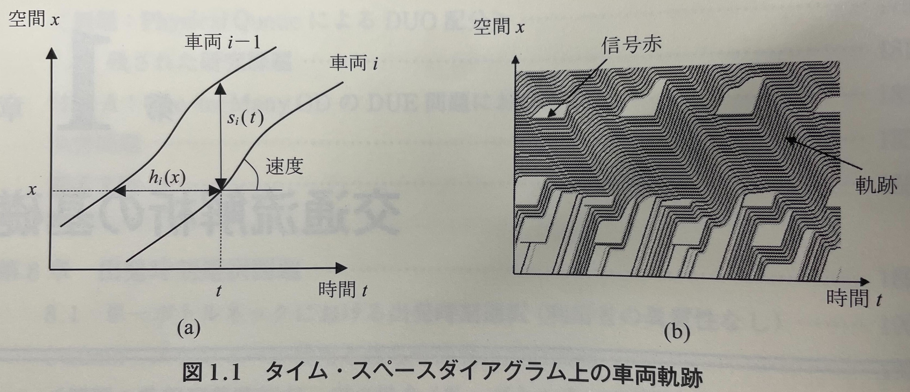
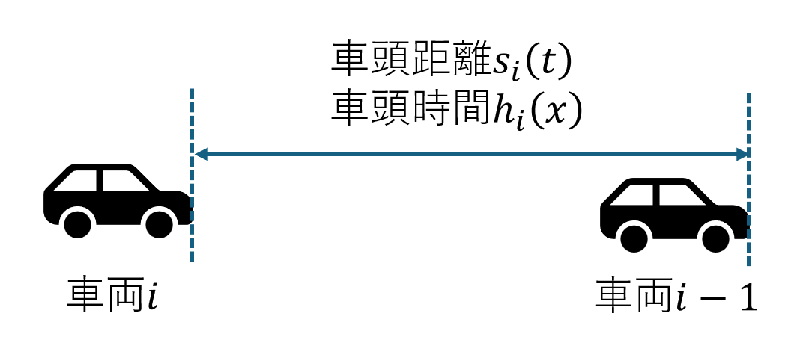
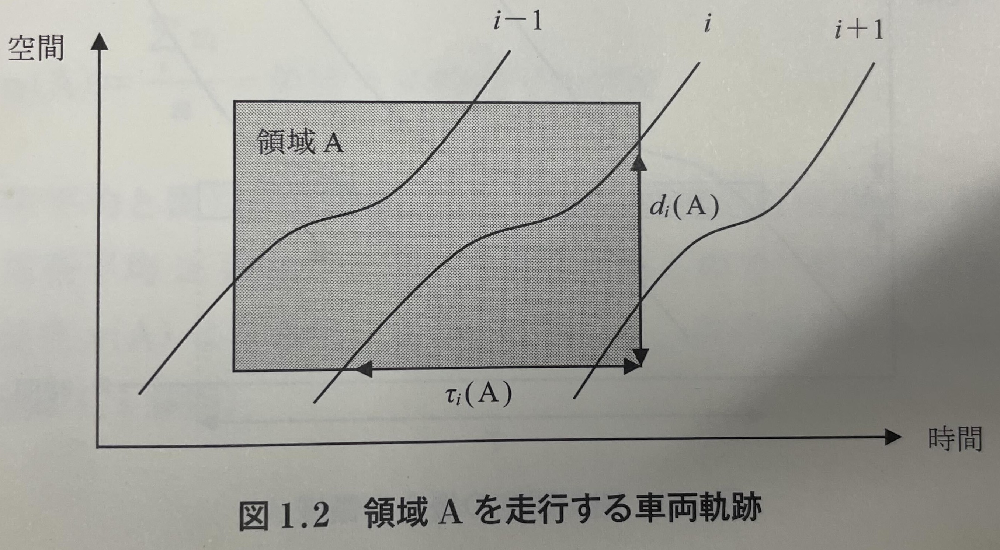
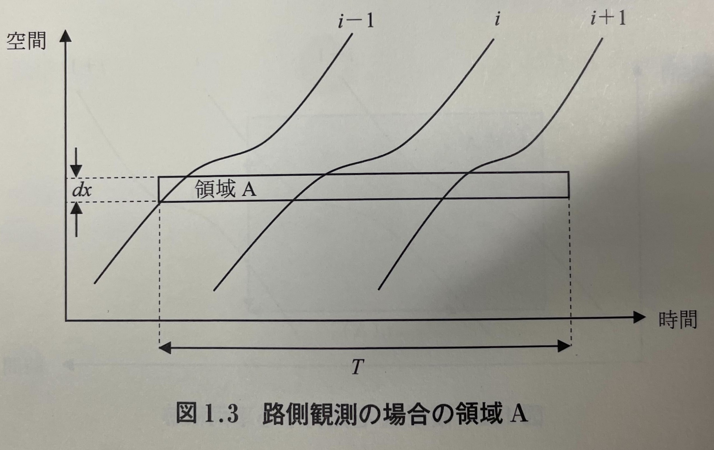
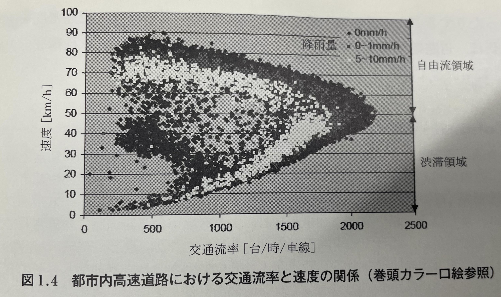
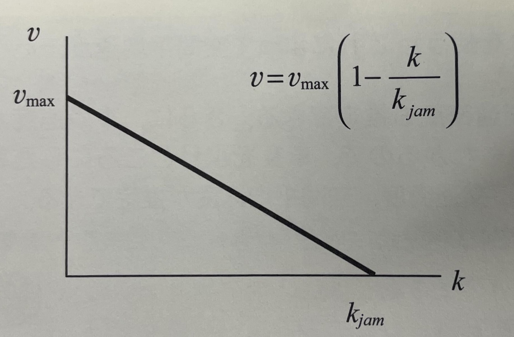
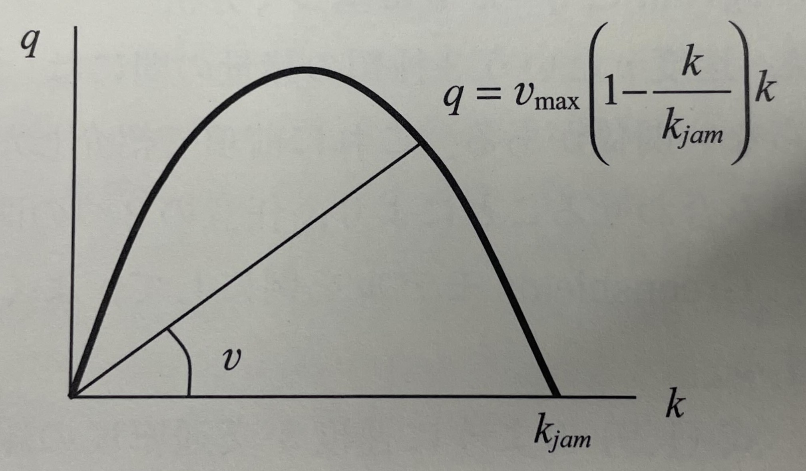
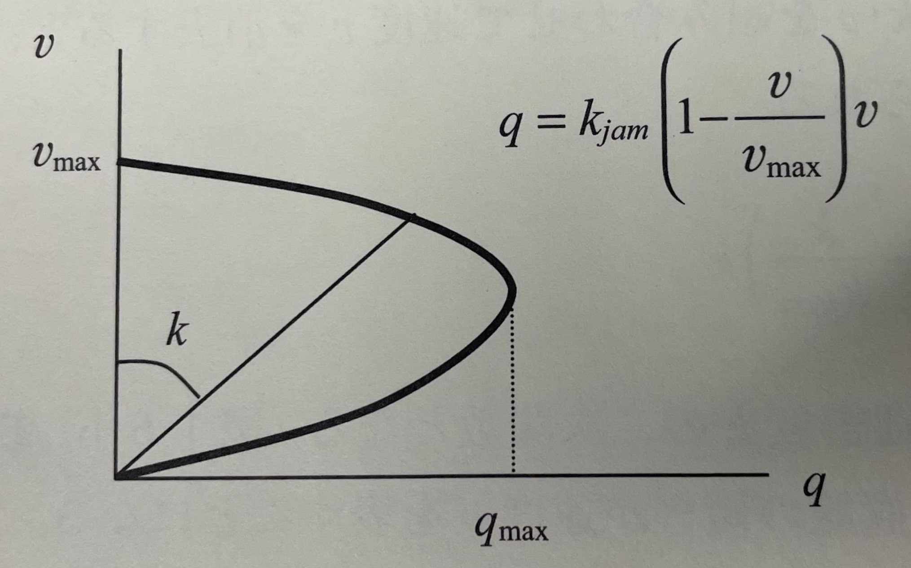
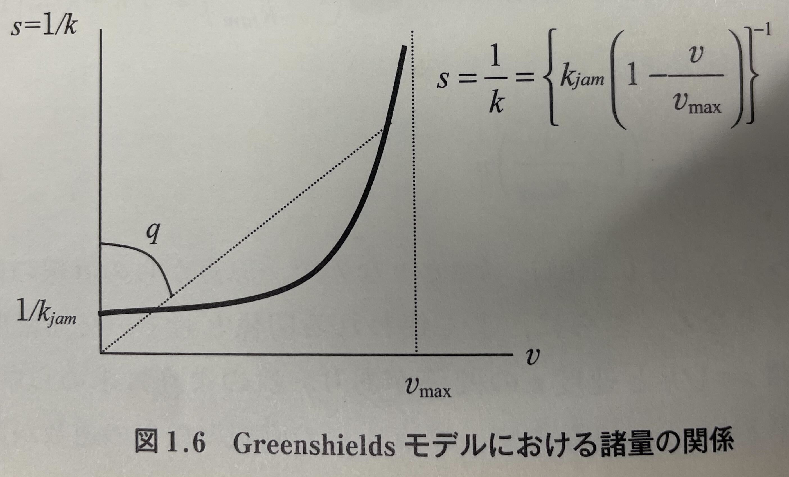
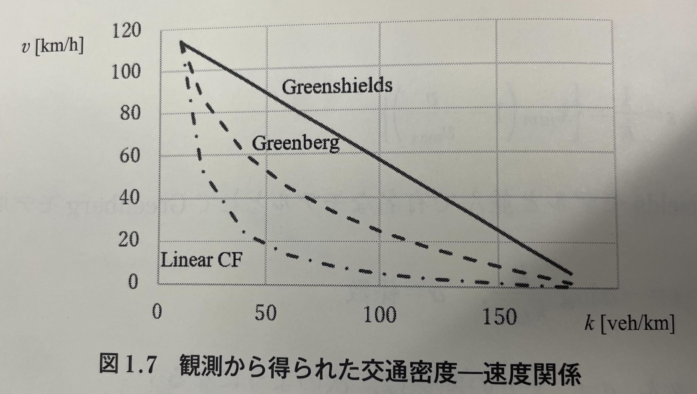

<!--
headingDivider: 2
-->

# M1ゼミ

Hibiki HATAKENAKA/畠中響生
2025/08/20

<!-- class: slides -->

# 1.1 タイム・スペースダイアグラム
- ある車両$i$の先端について，
$$
\begin{gather}
x_i(t)= (車両iの時刻tにおける位置)  \\
t_i(x)= (車両iの位置xにおける時刻)
\end{gather}
$$
と表せる．
- 距離を縦軸，時間を横軸に取ったものを**タイム・スペースダイアグラム**という(以下の図)

- タイム・スペースダイアグラムの傾きが大きいほど速度が大きく，傾きが0の場合停止を意味する．
- タイムスペースダイアグラムにおいて，車両$i$と前の車両$i-1$の距離方向の間隔を**車頭距離(spacing)**といい，車両$i$と前の車両$i-1$までの時間方向の間隔を**車頭時間(headway)**という．

- 車頭距離$s_i(t)$，車頭時間$h_i(x)$とすると，
$$
\begin{gather}
s_i(t) = x_{i-1}(t)-x_i(t)   \\
h_i(x) = t_i(x)-t_{i-1}(x)
\end{gather}
$$
- また，
$$
\begin{gather}
s(x,t) = (空間x, 時刻tにおける車頭距離) \\
h(x,t) = (空間x，時刻tにおける車頭時間)
\end{gather}
$$
と表すこともある．
# 1.2 交通流率，交通密度，速度の関係
## 1.2.1 定義

- 時空間に任意に定義できる領域$A$に対して(**式変形してみよう**)
$$
\begin{gather}
q(A) = \frac{1}{|A|}\sum_id_i(A) = 交通流率 [台/単位時間] \\
k(A) = \frac{1}{|A|}\sum_i\tau_i(A) = 交通密度[台/単位距離] \\
v(A) = \frac{\sum_id_i(A)}{\sum_i\tau_i(A)}= \frac{q(A)}{k(A)} = 空間平均速度[単位距離/単位時間]
\end{gather}
$$
- ここに，$|A|$は領域|A|の面積，$d_i(A)$は車両$i$の領域$A$内の走行距離，$\tau_i(A)$は車両$i$の領域$A$内の走行時間
- $q(A)$は単位時間当たりの観測位置を通過する台数
- $k(A)$は単位距離当たりの車両台数
- $v(A)$は$v_i$の調和平均であり算術平均ではない((総走行距離)/(総走行時間)だから)
	- 算術平均をとったものは**時間平均速度**$v_t(A)$という
	- 算術平均$\geq$調和平均なので$v_t(A)\geq v(A)$である
- $q(A) = k(A)・v(A)$の関係が成立
- どの車両も領域$A$内を通る距離が等しいとき($=L$)は，(**式変形してみよう**)
$$
\begin{gather}
q(A) = \frac{1}{|A|}\sum_id_i(A) = \frac{n・L}{T・L} = \frac{n}{T} \\
k(A) = \frac{1}{|A|}\sum_i\tau_i(A) = \frac{1}{|A|}\sum_i\frac{d_i(A)}{v_i} = \frac{1}{T}\sum_i\frac{1}{v_i} \\
v(A) = \frac{\sum_id_i(A)}{\sum_i\tau_i(A)}= \frac{\frac{n}{T}}{\frac{1}{T}\sum_i\frac{1}{v_i}} = \frac{n}{\sum_i\frac{1}{v_i}}
\end{gather}
$$
が成立．これは例えば路側での定点観測や，ETCやAVIのような地点間の旅行時間が計測できる場合に適用できる．

# 1.3交通流率-交通密度-速度の巨視的な関係
- q=kvの関係が常に成立するので，どれかひとつを観測すれば，残りの2つの関係を求めることができる．
## 1.3.1 経験的な観測結果
- Greenshields(1933, 1935)が世界で始めて定量的な交通密度と速度の関係を計測
- Greenshieldsモデル
$$
v = v_{max}(1-\frac{k}{k_{jam}})
$$
- ただし，$v_{max}$は速度の最大値，$k_{jam}$は交通密度の最大値(ジャム密度)
- **「最大交通密度に近づくほど，速度が低下する」**という関係

- 図1.4より速度が高い自由流領域では交通流率の増加に伴って速度は低下し，速度が低い渋滞領域では反対に交通流率の増加に伴って速度が増加する
- (Columnより)渋滞流が発生するのは，区間の下流にこの区間よりも容量が小さい区間が存在し，そこを先頭とした渋滞が当該区間に延伸してきた場合だけである
- q,k,vの関係は，道路幾何構造だけでなく，交通条件(運転者構成，車種構成，天候など)にも大きく影響
	- 最大交通流率は，(平日の都市内高速道路)>(休日の都市間高速道路)>(一般道路)
		- 都市内はプロドライバーが多く，都市間はサンデードライバーが多い
		- 一般道路は交差点や他の交通モードの存在
	- 雨によっても変化
## 1.3.2 Fundamental Diagramとq=kvに基づく分析
- $v = v_{max}(1-\frac{k}{k_{jam}})$よりk-v図は以下のようになる

- q=kvと，$v = v_{max}(1-\frac{k}{k_{jam}})$より，
$$
q = v_{max}(1-\frac{k}{k_{jam}})k
$$
- k-q図において，v=q/kなので傾きが速度を表す．

- q=kvと，$k = k_{jam}(1-\frac{v}{v_{max}})$より
$$
q = k_{jam}(1-\frac{v}{v_{max}})v
$$
- q-v図において，k=q/vなので原点からの直線の傾きの逆数が交通密度kを表す．

- また，車頭距離$s = \frac{1}{k}$と速度$v$の関係は
$$
s = \{k_{jam}({1-\frac{v}{v_{max}})}\}^{-1}
$$
と表せる．

- Greenshildsモデルのほかに，Greenbergモデルや，Linear Car followingモデルがある
	- Greenbergモデル
$$
\begin{gather}
v = -\alpha\log{\frac{k}{k_{jam}}} \\
q = -\alpha k \log{\frac{k}{k_{jam}}} \\
q = k_{jam} \exp{(-\frac{v}{\alpha})v} \\
s = \{k_{jam} \exp(-\frac{v}{\alpha})\}^{-1}
\end{gather}
$$
	- Linear Car Followingモデル
$$
\begin{gather}
v = \beta(\frac{1}{k}- \frac{1}{k_{jam}}) \\
q = \beta(\frac{1}{k}- \frac{1}{k_{jam}})k = \beta(1-\frac{k}{k_{jam}}) \\
q = (\frac{v}{\beta}+\frac{1}{k_{jam}})^{-1}v \\
s = \frac{v}{\beta} + \frac{1}{k_{jam}}
\end{gather}
$$
- 3つのモデルをk-v図に表すと図1.7のようになる

- 演習問題やってみましょう～