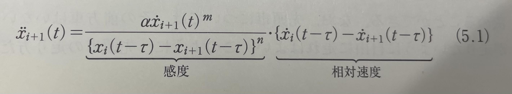
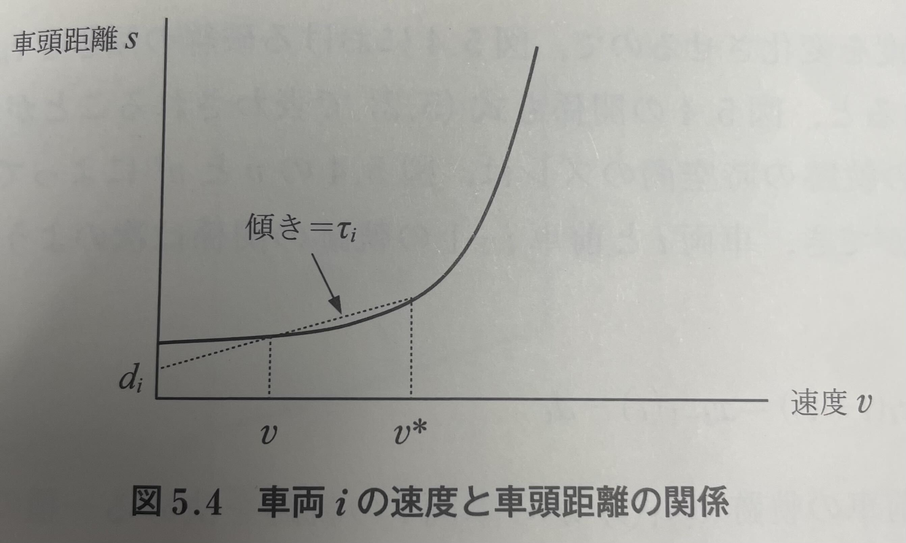
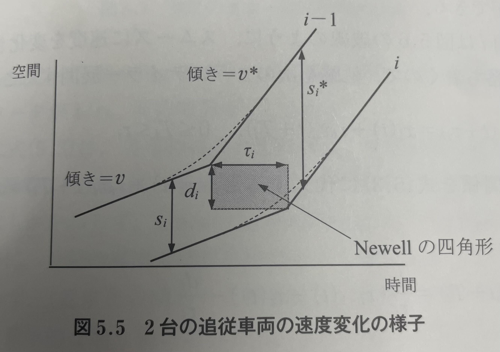
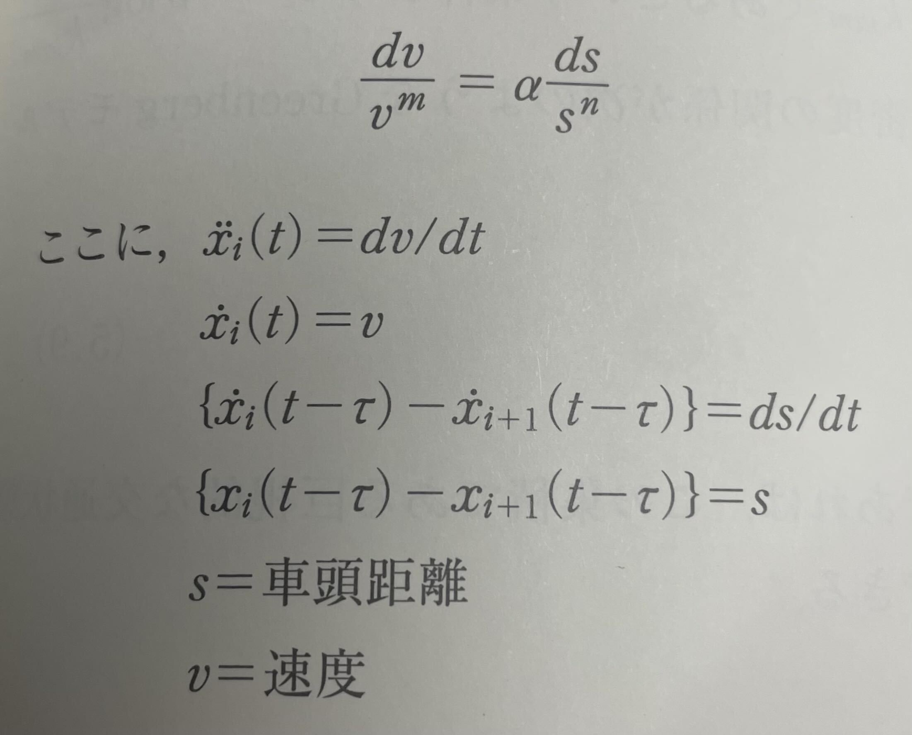

<!--
headingDivider: 2
-->

# M1ゼミ

Hibiki HATAKENAKA/畠中響生
2025/08/20

<!-- class: slides -->
## 目次
### 進捗報告
### 輪読

# 進捗報告

## 進捗報告
- 研究
- デザスタ

## 研究
- 自動運転バス乗ってきた
	- 路上駐停車全然できない
	- 信号連携しているので信号のかなり手前で減速
	- 夕方になり交通量増えると交差点付近で後続車かなりたまってた
- 分析
	- ネットワーク全体での影響評価は完了
	- 低速走行する自動運転バスにより影響を受けている時空間を特定し原因を探っているところ
- 既往研究のレビューとモデルやシミュレーターの理解などその辺もつめないとまずい

## 今後の研究の方向性
- L4バスの走行データがあるのでそこからパラメータを推定してシミュレーターの精度向上を図りたい
	- 「何をもって自動運転とするか」という大口先生の問いに答える
- グリーンウェーブはやりたい
	- 「自動運転車との協調」という文脈にするのか，速度50でオフセット最適化するのか速度30でオフセット最適化するのかどちらがいいのかみたいなもうすこし抽象度高めの設定でもよさそう
	- 信号制御も勉強しなければ

# 輪読会

## 定義
- $q(A)$は単位時間当たりの観測位置を通過する台数
- $k(A)$は単位距離当たりの車両台数
- $v(A)$は$v_i$の調和平均であり算術平均ではない((総走行距離)/(総走行時間)だから)
	- 算術平均をとったものは**時間平均速度**$v_t(A)$という
	- 算術平均$\geq$調和平均なので$v_t(A)\geq v(A)$である
- $q(A) = k(A)・v(A)$の関係が成立

## 1.3.1 経験的な観測結果
- Greenshields(1933, 1935)が世界で始めて定量的な交通密度と速度の関係を計測
- Greenshieldsモデル
$$
v = v_{max}(1-\frac{k}{k_{jam}})
$$
- ただし，$v_{max}$は速度の最大値，$k_{jam}$は交通密度の最大値(ジャム密度)
- <b>「最大交通密度に近づくほど，速度が低下する」</b>という関係

## 1.3.2 Fundamental Diagramとq=kvに基づく分析
### k-v関係
- $v = v_{max}(1-\frac{k}{k_{jam}})$よりk-v図は以下のようになる

## k-q関係
- q=kvと，$v = v_{max}(1-\frac{k}{k_{jam}})$より，
$$
q = v_{max}(1-\frac{k}{k_{jam}})k
$$
- k-q図において，v=q/kなので傾きが速度を表す．

## q-v関係
- q=kvと，$k = k_{jam}(1-\frac{v}{v_{max}})$より
$$
q = k_{jam}(1-\frac{v}{v_{max}})v
$$
- q-v図において，k=q/vなので原点からの直線の傾きの逆数が交通密度kを表す．

## 他のモデル
- Greenshildsモデルのほかに，Greenbergモデルや，Linear Car followingモデルがある
	- Greenbergモデル
$$
\begin{gather}
v = -\alpha\log{\frac{k}{k_{jam}}} \\
q = -\alpha k \log{\frac{k}{k_{jam}}} \\
q = k_{jam} \exp{(-\frac{v}{\alpha})v} \\
s = \{k_{jam} \exp(-\frac{v}{\alpha})\}^{-1}
\end{gather}
$$
## 他のモデル
- Linear Car Followingモデル
$$
\begin{gather}
v = \beta(\frac{1}{k}- \frac{1}{k_{jam}}) \\
q = \beta(\frac{1}{k}- \frac{1}{k_{jam}})k = \beta(1-\frac{k}{k_{jam}}) \\
q = (\frac{v}{\beta}+\frac{1}{k_{jam}})^{-1}v \\
s = \frac{v}{\beta} + \frac{1}{k_{jam}}
\end{gather}
$$
# 本編
## 追従理論とは
- 個別の車両がその前方車の動きに合わせて走行する様子を記述するモデル
- 自車の速度，前方車との速度，前方車との車頭距離などによって自車の加速度を説明するモデル
## 5.1 Gazis-Herman-Rothery(GHR)モデル

- 感度とは→入力値に対して出力値がどれだけ変化するか
- (感度)>0より速度大，車頭距離短いほど相対速度に対する感度は高くなる(現実でもそうですよね)
- 反応時間$\tau$とは相対速度，車頭距離を認識して自車の加速度を変更させるまでの時間遅れ

## 5.2Linear Car Followingモデル
- (5.1)式で，m=0，n=0，α=Const.としたもの
$$
\ddot{x}_{i+1}(t) = \alpha(\dot{x}_i(t-\tau)-\dot{x}_{i+1}(t-\tau))
$$
## 安定性
- パラメータ$\alpha$と反応時間$\tau$の積$C$の値により解析的に2種類の不安定性が明らかにされている
### ローカル不安定性
- 前車の速度変化による自車の挙動変化によって起こる，車頭距離の変化がゼロに収束しないこと
	- $C\leq\pi/2$のときローカルに安定で，車頭距離の変化はゼロに収束
	- $C>\pi/2$のときローカルに不安定で，車頭距離の変化は発散する
### 漸近不安定性
- 車頭距離の変化が後続車になるほど増大すること(後続車になるほど発散すること)
	- $C\leq0.5$のとき漸近安定で，車頭距離の変化は後続車になるほど小さくなり，ゼロに収束
	- $C>0.5$のとき漸近不安定で，車頭距離の変化は後続車になるほど大きくなり，発散
## イメージ
- $C$が小さい→速度変化に対する感度が鈍く，反応時間は早い

|        | C      |         |
| ------ | ------ | ------- |
| ~0.5   | ~\pi/2 | ~       |
| ローカル安定 | ローカル安定 | ローカル不安定 |
| 漸近安定   | 漸近不安定  | 漸近不安定   |
|        |        |         |
- ローカル不安定性は2台の車のみに着目
- 漸近不安定は交通流全体に着目
## 5.3 Simplified Car Followingモデル
- ある車両$i$が図5.4のような速度と車頭距離の関係に基づいて走行すると仮定
- 車両$i$が車両$i-1$に追従走行しているとき，$i-1$が速度を$v$から$v^*$に変化
- このとき$s_i=\tau_i v+d_i$と$s_i^*=\tau_i v^* +d_i$が導出される

## ぜひやってみて
- 図5.4から$x_i(t+\tau_i)=x_{i-1}(t)-d_i$
- テイラー展開
$$
x_i(t+\tau_i) = x_i(t) + \tau_i \dot{x}_i(t+T_i), \quad 0\leq T_i \leq \tau_i
$$
- 2式から
$$
\dot{x}_i(t+T_i)=\frac{1}{\tau_i}(x_{i-1}(t)-x_i(t))-\frac{d_i}{\tau_i}
$$
- さらにこれを時間微分すると<b>感度$1/\tau_i$，反応時間$T_i$のLinear Car Followモデルになる</b>
	- 反応時間なんて言う概念どこにもでてきてないのに...!
$$
\ddot{x}_i(t+T_i) = \frac{1}{\tau_i}(\dot{x}_{i-1}-\dot{x}_i(t))
$$
## 5.4 追従モデルと巨視的な交通状態との関係
- GHRモデルの定常状態を考える

- m=0，n=0のときの微分方程式解いてみて
## 答え合わせ
- これを解くと
$$
v=\frac{\alpha}{k_{jam}}(\frac{k_{jam}}{k}-1)
$$
- **Linear Car Followingモデルのk-v関係**
## 続いては
- m=0かつn=1解いてみて
## 答え合わせ
- これを解くと
$$
v=-\alpha log\frac{k}{k_{jam}}
$$

- **Greenbergモデルのk-v関係**
## まとめ
- 結論:追従モデルは微視的な(ミクロな)交通流モデルであり，これが定常状態になったと考えた時が巨視的な(マクロな)交通流
- ほかにもIDMモデルなどあるよ