# Annual Plan Gantt (2026-04 to 2027-03)

```mermaid

gantt

    title 2026-2027 Annual Plan

    dateFormat  YYYY-MM-DD

    axisFormat  %m

    excludes    weekends

  

    section 研究

    4月 ITSシンポに必要な分析を完了 :active, r1, 2026-04-01, 2026-04-30

    4月 INSTRの発表に向け追加分析 : r2, 2026-04-01, 2026-04-30

    5月 ITSシンポの執筆を頑張る : r3, 2026-05-01, 2026-05-31

    5月 INSTRの発表に向け追加分析 : r4, 2026-05-01, 2026-05-31

    5月 ITSシンポ査読あり締め切り5/31 : milestone, rm1, 2026-05-31, 0d

    6月 INSTRの発表に向け準備 : r5, 2026-06-01, 2026-06-30

    6月 TRBに必要な分析を完了 : r6, 2026-06-01, 2026-06-30

    7月 TRBの執筆頑張る : r7, 2026-07-01, 2026-07-31

    7/15-7/17 INSTR : milestone, rm2, 2026-07-15, 3d

    8月 TRB締め切り8/1 : milestone, rm3, 2026-08-01, 0d

    9月 TRBの修正 : r8, 2026-09-01, 2026-09-30

    9月 武者修行に向けて準備 : r9, 2026-09-01, 2026-09-30

    10月 武者修行 : r10, 2026-10-01, 2026-10-31

    10月 ITSシンポ札幌に向け準備 : r11, 2026-10-01, 2026-10-31

    11月 ITSシンポ@札幌 : milestone, rm4, 2026-11-01, 5d

    11月 修論執筆 : r12, 2026-11-01, 2026-11-30

    11/22 技術士一次試験 : milestone, rm5, 2026-11-22, 0d

    12月 修論執筆 : r13, 2026-12-01, 2026-12-31

    12月 TRBに向け準備 : r14, 2026-12-01, 2026-12-31

    1月 TRB annual meeting : milestone, rm6, 2027-01-01, 7d

    1月 修論締め切り : milestone, rm7, 2027-01-31, 0d

    2月 修論報告会 : milestone, rm8, 2027-02-15, 1d

  

    section 体づくり

    4月 体重73kg以下 : t1, 2026-04-01, 2026-04-30

    4月 10kmを60分で走れるようになる : t2, 2026-04-01, 2026-04-30

    5月 10kmを55分で走れるようになる : t3, 2026-05-01, 2026-05-31

    5/31までにシックスパック＆70kg以下 : milestone, tm1, 2026-05-31, 0d

    6月 10kmマラソン（50分切りを目指す） : milestone, tm2, 2026-06-20, 1d

    7月 ハーフマラソン（2時間切りを目指す） : milestone, tm3, 2026-07-20, 1d

    8/30 北海道マラソン（3時間半切りを目指す） : milestone, tm4, 2026-08-30, 1d

    9月 ベンチ50kg : milestone, tm5, 2026-09-30, 0d

    10月 ベンチ60kg : milestone, tm6, 2026-10-31, 0d

    11月 ベンチ70kg : milestone, tm7, 2026-11-30, 0d

    12月 ベンチ80kg : milestone, tm8, 2026-12-31, 0d

    1月 ベンチ90kg : milestone, tm9, 2027-01-31, 0d

    2月 ベンチ100kg : milestone, tm10, 2027-02-28, 0d

    3月 ベンチ100kg維持 : t4, 2027-03-01, 2027-03-31

  

    section 語学

    4月 Distinction1日1章 : l1, 2026-04-01, 2026-04-30

    4月 週に3回英会話 : l2, 2026-04-01, 2026-04-30

    5月 Distinction1日1章 : l3, 2026-05-01, 2026-05-31

    5月 週に3回英会話 : l4, 2026-05-01, 2026-05-31

    6/13 TOEIC : milestone, lm1, 2026-06-13, 0d

    6月 Distinctionをマスター : l5, 2026-06-01, 2026-06-30

    6月 週に3回英会話 : l6, 2026-06-01, 2026-06-30

    7月 週に3回英会話 : l7, 2026-07-01, 2026-07-31

    8月 週に3回英会話 : l8, 2026-08-01, 2026-08-31

    9月 週に3回英会話 : l9, 2026-09-01, 2026-09-30

    10月 週に3回英会話 : l10, 2026-10-01, 2026-10-31

    11月 週に3回英会話 : l11, 2026-11-01, 2026-11-30

    12月 TOEIC 900越えを目指す : l12, 2026-12-01, 2026-12-31

    12月 週に3回英会話 : l13, 2026-12-01, 2026-12-31

    1月 週に3回英会話 : l14, 2027-01-01, 2027-01-31

    2月 週に3回英会話 : l15, 2027-02-01, 2027-02-28

    3月 週に3回英会話 : l16, 2027-03-01, 2027-03-31

  

    section 旅行

    5月 韓国旅行（10万） : v1, 2026-05-10, 3d

    5月 キャンプor小旅行（5万） : v2, 2026-05-24, 2d

    6月 キャンプor小旅行（5万） : v3, 2026-06-20, 2d

    7月 INSTRのあと1週間旅行（20万） : v4, 2026-07-18, 7d

    7月 キャンプor小旅行（5万） : v5, 2026-07-28, 2d

    8月 北海道マラソンのあと1-2週間放浪（15万） : v6, 2026-08-31, 12d

    8月 キャンプor小旅行（5万） : v7, 2026-08-15, 2d

    9月 2週間放浪旅①（15万） : v8, 2026-09-05, 14d

    9月 ラボ旅行（2万） : v9, 2026-09-20, 2d

    9月 キャンプor小旅行（5万） : v10, 2026-09-27, 2d

    10月 武者修行？（20万） : v11, 2026-10-05, 21d

    11月 ITSシンポのあとミニ旅行（5万） : v12, 2026-11-07, 3d

    11月 キャンプor小旅行（5万） : v13, 2026-11-21, 2d

    12月 12月上旬ゆうちゃんとドイツ・チェコ旅行（30万） : v14, 2026-12-03, 10d

    12月 スノボor小旅行（5万） : v15, 2026-12-26, 2d

    1月 スノボor小旅行（5万） : v16, 2027-01-20, 2d

    2月 スノボor小旅行（5万） : v17, 2027-02-10, 2d

    2月 冬の北海道サウナ旅（2weeks, 15万） : v18, 2027-02-12, 14d

    3月 スノボor小旅行（5万） : v19, 2027-03-05, 2d

    3月 2週間放浪②（15万） : v20, 2027-03-10, 14d

  

    section 予算・お金

    4月 予算5.8万＋自転車購入10万 : b1, 2026-04-01, 2026-04-30

    5月 予算20万 : b2, 2026-05-01, 2026-05-31

    6月 予算11万 : b3, 2026-06-01, 2026-06-30

    7月 予算31万 : b4, 2026-07-01, 2026-07-31

    8月 予算25万 : b5, 2026-08-01, 2026-08-31

    9月 予算27万 : b6, 2026-09-01, 2026-09-30

    10月 予算25万 : b7, 2026-10-01, 2026-10-31

    11月 予算15万 : b8, 2026-11-01, 2026-11-30

    12月 予算40万 : crit, b9, 2026-12-01, 2026-12-31

    1月 予算10万 : b10, 2027-01-01, 2027-01-31

    2月 予算25万 : b11, 2027-02-01, 2027-02-28

    3月 予算25万 : b12, 2027-03-01, 2027-03-31

```

  

| 月   | 研究                                                            | 体づくり                                           | 語学                                                     | 旅行・娯楽                                             |
| --- | ------------------------------------------------------------- | ---------------------------------------------- | ------------------------------------------------------ | ------------------------------------------------- |
| 4月  | - ITSシンポに必要な分析を完了 - INSTRの発表に向け追加分析                        | - 体重73kg以下 - 10kmを60分で走れるようになる              | - Distinction 1日1章 - 週に3回英会話                        | - 自転車10万円を購入（別管理にしても可）                            |
| 5月  | - ITSシンポの執筆を頑張る - INSTRの発表に向け追加分析 - ITSシンポ査読あり締め切り 5/31 | - 10kmを55分で走れるようになる - 5/31までにシックスパック＆70kg以下 | - Distinction 1日1章 - 週に3回英会話                        | - 韓国旅行（10万） - キャンプ or 小旅行（5万）                  |
| 6月  | - INSTRの発表に向け準備 - TRBに必要な分析を完了                             | - 10kmマラソン（50分切りを目指す）（1万）                      | - 6/13 TOEIC（8000円） - Distinctionをマスター - 週に3回英会話 | - キャンプ or 小旅行（5万）                                 |
| 7月  | - TRBの執筆頑張る - 7/15–7/17 INSTR                              | - ハーフマラソン（2時間切りを目指す）（1万）                       | - 週に3回英会話                                              | - INSTRのあと1週間旅行（20万） - キャンプ or 小旅行（5万）         |
| 8月  | - TRB締め切り 8/1                                                 | - 北海道マラソン 8/30（3時間半切りを目指す）                     | - 週に3回英会話                                              | - 北海道マラソンのあと1〜2週間放浪（15万） - キャンプ or 小旅行（5万）     |
| 9月  | - TRBの修正 - 武者修行に向けて準備                                      | - ベンチ50kg                                      | - 週に3回英会話                                              | - 2週間放浪旅①（15万） - ラボ旅行（2万） - キャンプ or 小旅行（5万） |
| 10月 | - 武者修行？（20万） - ITSシンポ札幌に向け準備                               | - ベンチ60kg                                      | - 週に3回英会話                                              | - 武者修行をここに入れる想定                                   |
| 11月 | - ITSシンポ@札幌 - 修論執筆 - 11/22 技術士一次試験                      | - ベンチ70kg                                      | - 週に3回英会話                                              | - ITSシンポのあとミニ旅行（5万） - キャンプ or 小旅行（5万）          |
| 12月 | - 修論執筆 - TRBに向け準備                                          | - ベンチ80kg                                      | - TOEIC 900越えを目指す - 週に3回英会話                         | - 12月上旬 ゆうちゃんとドイツ・チェコ旅行（30万） - スノボ or 小旅行（5万）  |
| 1月  | - TRB annual meeting - 修論締め切り                              | - ベンチ90kg                                      | - 週に3回英会話                                              | - スノボ or 小旅行（5万）                                  |
| 2月  | - 修論報告会                                                       | - ベンチ100kg                                     | - 週に3回英会話                                              | - スノボ or 小旅行（5万） - 冬の北海道サウナ旅（2weeks, 15万）      |
| 3月  | - 研究の整理・卒業準備                                                  | - ベンチ100kg                                     | - 週に3回英会話                                              | - スノボ or 小旅行（5万） - 2週間放浪②（15万）                 |

## メモ

- Obsidian で Mermaid が有効なら、そのまま表示されます。

- 日付は仮置きです。実際の日程が決まったら各行の開始日と期間を直してください。

- 1つの図に全部入れているので、表示が縦に長いです。必要なら次に「研究・体/語学・旅行/予算」の3分割版も作れます。