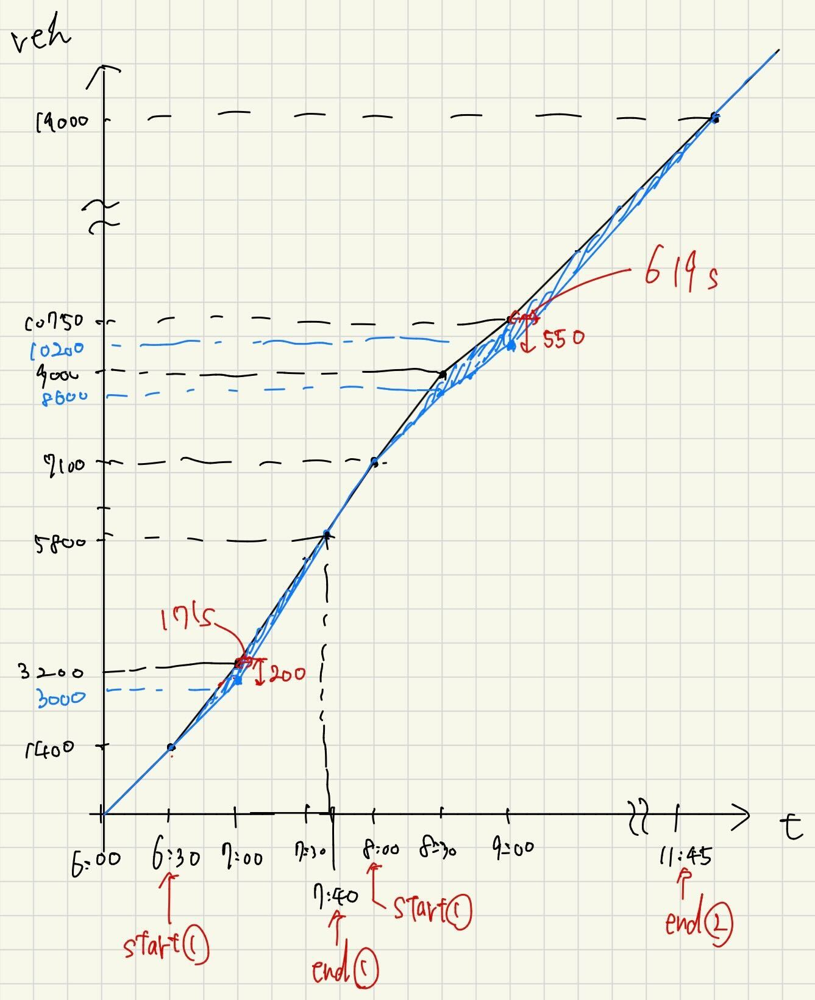
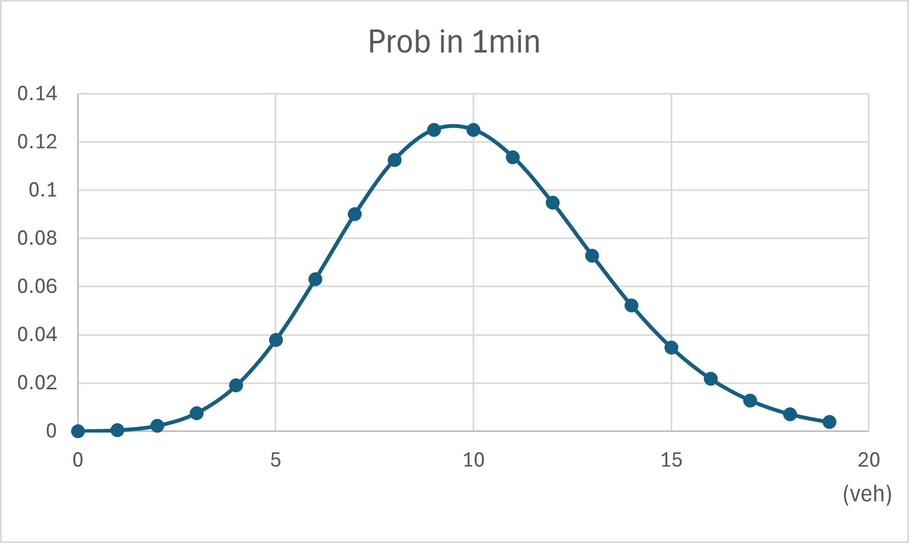
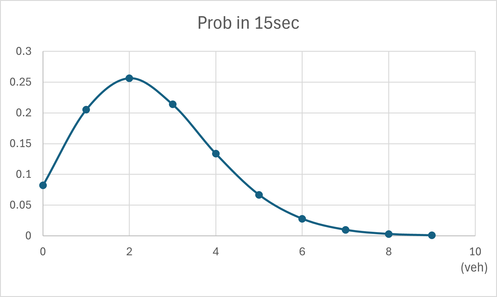
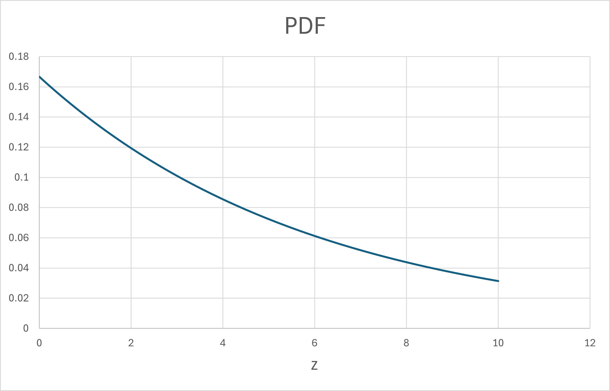
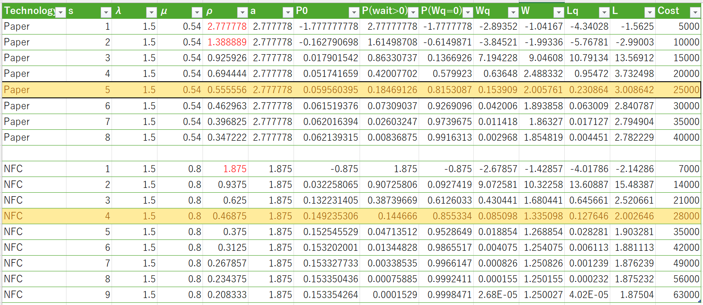

# Problem1
Capacity (veh/h):

Normal condition:
$$
C = 3200
$$

With hard shoulder operation:
$$
C = 4200
$$

During incident (08:00–08:30):
$$
C = 4200 - 1200 = 3000
$$

Arrival rates (veh/h):
$$
\lambda(t)=
\begin{cases}
2800 & 06{:}00–06{:}30 \\
3600 & 06{:}30–07{:}00 \\
3900 & 07{:}00–08{:}00 \\
3800 & 08{:}00–08{:}30 \\
3500 & 08{:}30–09{:}00 \\
3000 & 09{:}00–
\end{cases}
$$

All cumulative vehicle counts are measured from 06:00, where
$$
N_A(06{:}00)=N_D(06{:}00)=0.
$$

【Cumulative Arrivals $N_A(t)$ and Departures $N_D(t)$】

06:30
$$
N_A(06{:}30)=2800\times0.5=1400
$$
Since no queue exists,
$$
N_D(06{:}30)=1400.
$$

07:00
$$
N_A(07{:}00)=1400+3600\times0.5=3200
$$
$$
N_D(07{:}00)=1400+3200\times0.5=3000
$$

07:40
$$
\begin{aligned}
N_A(07{:}40) &= 3200+3900\times\frac{2}{3}=5800, \\
N_D(07{:}40) &= 3000+4200\times\frac{2}{3}=5800.
\end{aligned}
$$
The first congestion is fully dissipated at this time.

08:00
$$
N_A(08{:}00)=5800+3900\times\frac{1}{3}=7100
$$
$$
N_D(08{:}00)=7100
$$

08:30
$$
\begin{aligned}
N_A(08{:}30) &= 7100+3800\times0.5=9000, \\
N_D(08{:}30) &= 7100+3000\times0.5=8600.
\end{aligned}
$$

09:00
$$
\begin{aligned}
N_A(09{:}00) &= 9000+3500\times0.5=10750, \\
N_D(09{:}00) &= 8600+3200\times0.5=10200.
\end{aligned}
$$

- (a) Congestion periods

Congestion occurs when the arrival rate exceeds the departure capacity.

The first congestion starts at 06:30 and ends at 07:40, when the cumulative arrival and departure curves intersect again.

The second congestion starts at 08:00 due to the incident-induced capacity reduction.
After 09:00, the arrival rate becomes lower than the capacity, and the congestion is fully dissipated at 11:45.

- (b) Maximum queue length

The queue length at time $t$ is given by
$$
Q(t)=N_A(t)-N_D(t).
$$

At 07:00:
$$
Q(07{:}00)=3200-3000=200 \text{ vehicles}.
$$

At 09:00:
$$
Q(09{:}00)=10750-10200=550 \text{ vehicles}.
$$

Therefore, the maximum queue length is
$$
Q_{\max}=550 \text{ vehicles}.
$$
- (c) Maximum waiting time】

The maximum waiting time is defined as the maximum horizontal distance between the cumulative arrival and departure curves, measured at the time when the queue length is maximum.

First congestion ($t^*=07{:}00$):

$$
N_A(07{:}00)=3200,\quad N_D(07{:}00)=3000
$$

After 07:00, the departure rate is 4200 veh/h.
The maximum waiting time is therefore
$$
\begin{aligned}
W_{\max,1}
&=\frac{3200-3000}{4200} \\
&=0.047619 \text{ h} \\
&\approx 171 \text{ s}.
\end{aligned}
$$

Second congestion ($t^*=09{:}00$):

$$
N_A(09{:}00)=10750,\quad N_D(09{:}00)=10200
$$

After 09:00, the departure rate is 3200 veh/h.
Thus,
$$
\begin{aligned}
W_{\max,2}
&=\frac{10750-10200}{3200} \\
&=0.171875 \text{ h} \\
&\approx 619 \text{ s}.
\end{aligned}
$$

- (d) Aggregate delay

The aggregate delay corresponds to the area between the cumulative arrival and departure curves.

First congestion:

$$
\begin{aligned}
D_1
&=\frac{1}{2}\times0.5\times200
 +\frac{1}{2}\times\frac{2}{3}\times200 \\
&=116.67 \text{ veh·h}.
\end{aligned}
$$

Second congestion:

$$
\begin{aligned}
D_2
&=\frac{1}{2}\times0.5\times400
 +\frac{400+550}{2}\times0.5
 +\frac{1}{2}\times2.75\times550 \\
&=1093.75 \text{ veh·h}.
\end{aligned}
$$

【Summary】
- First congestion: 06:30–07:40
- Second congestion: 08:00–11:45
- Maximum queue length: 550 vehicles (at 09:00)
- Maximum waiting time:
  - First congestion: 171 s
  - Second congestion: 619 s
- Aggregate delay:
  - First congestion: 116.67 veh·h
  - Second congestion: 1093.75 veh·h

# Problem 2 
$$
\lambda = 600\ \mathrm{veh/h}
$$

$$
\lambda = \frac{600}{3600} = \frac{1}{6}\ \mathrm{veh/s}
$$

$$
\lambda = \frac{600}{60} = 10\ \mathrm{veh/min}
$$
- (a)

The probability mass function (PMF) is given by

$$
P(X=x)=\frac{(\lambda t)^x e^{-\lambda t}}{x!}, \quad x=0,1,2,\dots
$$

For a 1-minute interval (t = 1 min):

$$
\lambda t = 10
$$

$$
P(X=x)=\frac{10^x e^{-10}}{x!}, \quad x \in \{0,1,\dots,19\}
$$

For a 15-second interval (t = 15 s):

$$
\lambda t = \frac{1}{6}\times 15 = 2.5
$$

$$
P(X=x)=\frac{2.5^x e^{-2.5}}{x!}, \quad x \in \{0,1,\dots,9\}
$$

- (b)
$$
\lambda t = \frac{1}{6}\times 5 = \frac{5}{6}
$$

$$
P(X \ge 1) = 1 - P(X=0)
$$

$$
P(X \ge 1) = 1 - e^{-5/6}≒0.57
$$

- (c) Probability density function of time headway
For a Poisson process, the time headway Z follows an exponential distribution:

$$
Z \sim \mathrm{Exponential}(\lambda)
$$

The probability density function (PDF) is

$$
f_Z(z)=\lambda e^{-\lambda z}, \quad z \ge 0
$$

Substituting λ = 1/6 veh/s:
$$
f_Z(z)=\frac{1}{6}e^{-z/6}, \quad z \ge 0
$$

- (d) Probability that the headway is exactly 3 seconds

This question is not valid. The time headway is a continuous random variable, and the probability that a continuous random variable takes an exact value is zero.

$$
P(Z=3)=0
$$

- (e) Probability that the headway is between 2 and 4 seconds
The cumulative distribution function (CDF) of the exponential distribution is

$$
F_Z(z)=1-e^{-\lambda z}
$$
Therefore,

$$
P(2 \le Z \le 4)=F_Z(4)-F_Z(2)
$$

$$
P(2 \le Z \le 4)
= \left(1-e^{-4/6}\right)-\left(1-e^{-2/6}\right)
$$

$$
P(2 \le Z \le 4)=e^{-2/6}-e^{-4/6}≒0.20
$$
# Problem 3
- (a)
In an M/M/s queueing model, the service time is assumed to be random.  
For an automatic ticket gate system, the service rate can reasonably be considered stochastic for several reasons.

First, users differ in their level of familiarity and reaction speed. The time required to insert and retrieve a paper ticket or to tap an NFC card varies from user to user.  
Second, occasional errors such as misreading of paper tickets or communication failures in NFC systems may occur, requiring re-insertion or re-tapping and thus increasing the service time.  
Third, during congested periods, differences in walking speed, luggage, or interference from surrounding users can affect the effective time required to pass through the gate.

Due to these factors, the service time is not constant even for the same gate, and therefore the service rate should be modeled as a random variable, which justifies the use of the M/M/s framework.

- (b)
In this problem, the system configuration is evaluated by considering both system cost and user experience.
The following five performance measures are used for comparison:

- Probability of zero waiting time, P(Wq = 0)
- Expected number of users in the system, L
- Expected number of users in the queue, Lq
- Expected duration in the system, W
- Expected duration in the queue, Wq

Cases with ρ ≥ 1 are excluded from the evaluation, since no steady-state distribution exists under such conditions.

Based on the computed results, Paper (s = 5) and NFC (s = 4) are identified as feasible candidates, as both configurations achieve sufficiently low waiting times and congestion levels.

For Paper (s = 5), the probability of zero waiting time is P(Wq = 0) = 0.815, the expected number of users in the system and in the queue are L = 3.01 and Lq = 0.23, respectively, and the expected duration in the system and in the queue are W = 2.01 and Wq = 0.154. The corresponding system cost is 25,000.

For NFC (s = 4), the service performance is slightly better, with P(Wq = 0) = 0.855, L = 2.00, Lq = 0.13, W = 1.34, and Wq = 0.085. However, this configuration requires a higher system cost of 28,000.

Although NFC (s = 4) outperforms Paper (s = 5) in all service-related metrics, the improvement is relatively limited. Paper (s = 5) still provides a sufficiently high level of service, as more than 80% of users experience no waiting time and both the expected waiting time and queue length remain small.

Therefore, considering that a comparable level of service quality can be achieved at a lower system cost, Paper (s = 5) is selected as the preferred system configuration.

