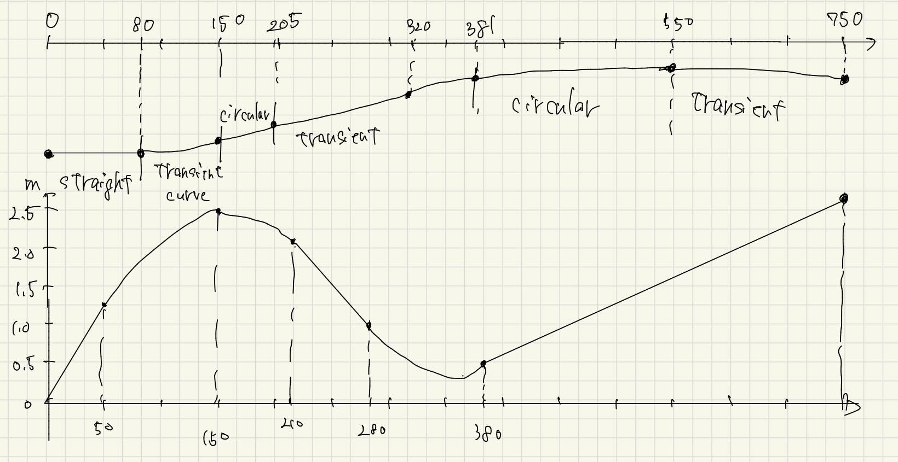

# Problem 1

## Given conditions
AADT = 30,000 veh/day (both directions)

Truck ratio:
$$
P_T = 9%
$$
Passenger car equivalence:
$$
E_T = 2.1
$$
Road conditions:
- Rural highway
- Dual carriageway
- Lane width $W_L = 3.5 m$
- Lateral clearance = 0.6 m (median side)
- No on-street parking
- Minor road access exists
- Design level = 2

## DHV
For a multi-lane highway, DHV for the heavier direction is calculated as

DHV = AADT × K × D

Assumptions based on lecture standards:
- Touristic area: K = 0.16
- Rural area directional factor: D = 0.60

Calculation:
$$
DHV = 30,000 × 0.16 × 0.60
    = 2,880 veh/h
$$
## Design Capacity
Basic capacity for a multi-lane highway:
$$
C_B = 2,200 [pcu/h/lane]
$$
Correction factors:
$$
\begin{gather}
	γ_L = 1.00  \\
	γ_C = 0.98   \\
	γ_I = 0.95 \\
\end{gather}
$$

Truck correction factor:
$$
\begin{gather}
	γ_T = 100 / [(100 − P_T) + E_T × P_T] \\
     = 100 / [(100 − 9) + 2.1 × 9] \\
     = 100 / 109.9 \\
     = 0.909
\end{gather}
$$
Possible capacity:
$$
\begin{align}
	C_P &= C_B × γ_L × γ_C × γ_I × γ_T \\
    &= 2,200 × 1.00 × 0.98 × 0.95 × 0.909 \\
    &≈ 1,864 veh/h/lane
\end{align}

Design capacity (Design level 2, V/C = 0.85):
C_D = C_P × 0.85
    ≈ 1,584 veh/h/lane
$$
## Number of lanes
Required DHV (per direction):
2,880 veh/h

Capacity with 1 lane:
1,584 < 2,880  → insufficient

Capacity with 2 lanes:
2 × 1,584 = 3,168 > 2,880  → sufficient

## Final Answer
The required number of lanes is:

Each direction: 2 lanes

## Problem 2

-  (a) 
#### Horizontal alignment
From the curvature diagram ($k = 1/R$), inclined straight lines represent
transition curves (clothoids), while horizontal segments represent circular
curves with constant radius.

For a clothoid, the following relation applies:

$$
L = \frac{A^2}{R}
$$

- (1)
Between station 80 and 150, the curvature changes from 0 to $1/420$.
Thus this section is a transition curve with length

$$
L = 150 - 80 = 70 \ \text{m}.
$$

The clothoid parameter is

$$
A = \sqrt{R L} = \sqrt{420 \times 70} \approx 171.
$$

Therefore, **(1) = 171**.

- (2)
Between station (2) and 320, a transition curve with $A = 220$ and $R = 420$
(from $1/420$ to 0) is given.
$$
L = \frac{A^2}{R} = \frac{220^2}{420} \approx 115 \ \text{m}.
$$

Since the transition ends at station 320,

$$
(2) = 320 - 115 \approx 205.
$$

Therefore, **(2) = 205**.

- (3)  
Between station 320 and (3), the curvature changes from 0 to $1/800$.
From the diagram, this transition has the same slope as the previous one,
thus the same clothoid parameter $A = 220$ is assumed.

$$
L = \frac{220^2}{800} \approx 60.5 \ \text{m}.
$$

$$
(3) = 320 + 60.5 \approx 381.
$$

Therefore, **(3) = 381**.

- (4)
Between station 550 and (4), a transition curve with $A = 400$ and $R = 800$
is given.

$$
L = \frac{400^2}{800} = 200 \ \text{m}.
$$

$$
(4) = 550 + 200 = 750.
$$

Therefore, **(4) = 750**.
#### Vertical alignment
In the vertical grade diagram, the vertical axis represents the grade [%].
Using the small-angle approximation for a vertical curve,

$$
d \simeq R_v |\Delta g|
$$

where $\Delta g$ is the grade difference expressed as a decimal.

- (5)
Between station 50 and 150, the grade changes from +2.5% to 0%.

$$
d = 150 - 50 = 100 \ \text{m}
$$

$$
|\Delta g| = |0 - 0.025| = 0.025
$$

$$
R_v = \frac{d}{|\Delta g|} = \frac{100}{0.025} = 4000.
$$

Therefore, **(5) = 4000**.
- (6)
The same vertical curve ($R_v = 4000$) continues from station 150 until the
grade reaches −1.5% at station (6).

$$
|\Delta g| = | -0.015 - 0 | = 0.015
$$

$$
d = 4000 \times 0.015 = 60 \ \text{m}
$$

$$
(6) = 150 + 60 = 210.
$$

Therefore, **(6) = 210**.

- (7)
The next vertical curve has $R_v = 5000$ and connects grades from −1.5% to
+0.5%, with its end point at station 380.

$$
|\Delta g| = |0.005 - (-0.015)| = 0.020
$$

$$
d = 5000 \times 0.020 = 100 \ \text{m}
$$

$$
(7) = 380 - 100 = 280.
$$

Hence, the results are:

(1) = 171, (2) = 205, (3) = 381, (4) = 750,  
(5) = 4000, (6) = 210, (7) = 280.

- (b) 
Regarding the horizontal alignment, the minimum curve radius in this design
is $R = 420$ m. This value may be smaller than the standard minimum radius
for a design speed of 100 km/h (e.g., 460 m), although it satisfies the
exceptional minimum value (e.g., 380 m). Therefore, the margin for maintaining
the design speed is limited.

In addition, some transition curves have lengths of approximately 70 m and
60 m, which may be shorter than the minimum transition length for 100 km/h
(e.g., 85 m). Since the alignment includes an S-shaped curve, rapid steering
changes may occur, increasing driver workload.

For the vertical alignment, the section from station 50 to (6) forms a crest
vertical curve with a radius of $R_v = 4000$ m. This value may be smaller than
the standard requirement for a design speed of 100 km/h (e.g., 6500 m), and
thus caution is required from the viewpoint of sight distance. On the other
hand, the vertical curve from (7) to 380 is a sag curve with $R_v = 5000$ m,
which generally satisfies typical design criteria.

Overall, while the alignment is feasible, several sections provide limited
safety margins for a design speed of 100 km/h, particularly in terms of
horizontal curve radius, transition length, and the crest vertical curve.

- (c)
