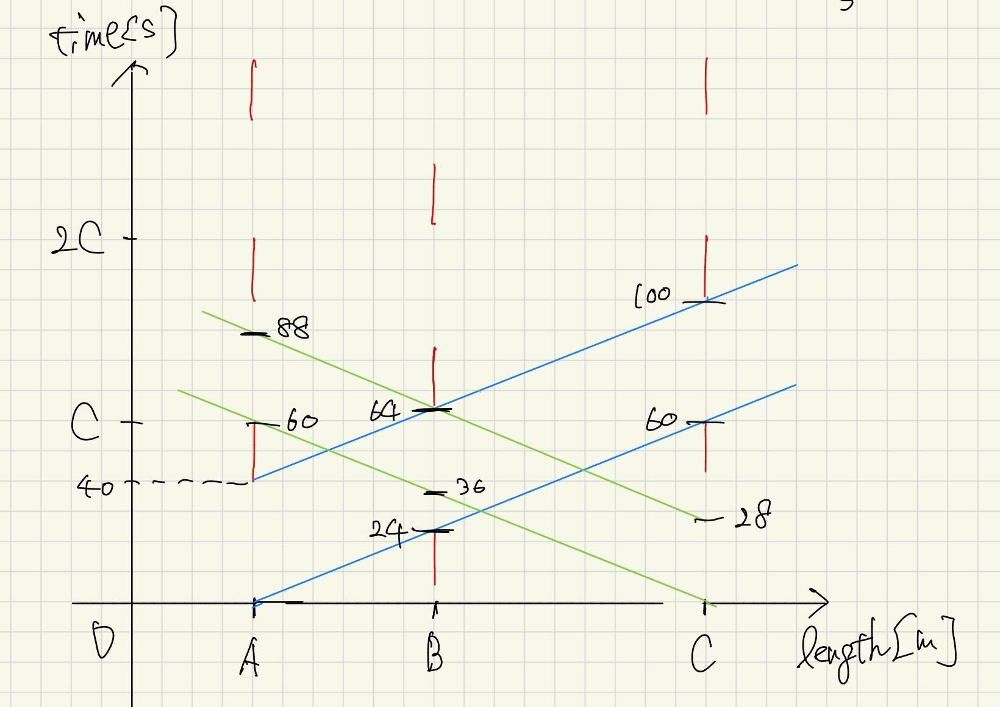

# Problem1
- (a) 
Plan 2 is considered to be more efficient than Plan 1.
In Plan 2, Phase 2 can accommodate the upper-left pedestrian crossing while simultaneously serving the two largest traffic demands,
South→East ($390\ \mathrm{veh/h}$) and East→South ($300\ \mathrm{veh/h}$).
By allowing these high-demand turning movements to operate concurrently within a single phase,
Plan 2 reduces the overall critical flow ratio $\rho$ and avoids introducing additional stages or lost times.
As a result, Plan 2 is expected to achieve better operational efficiency with lower control delay.
## Given
- Demands (veh/h):  
  $v_{\mathrm{WE}}=750,\ v_{\mathrm{WS}}=120,\ v_{\mathrm{EW}}=650,\ v_{\mathrm{ES}}=300,\ v_{\mathrm{SW}}=90,\ v_{\mathrm{SE}}=390$
- Saturation flows (veh/h/lane):  
  Straight: $s_{\mathrm{str}}=1950$ , Turning: $s_{\mathrm{turn}}=1700$
- Total lost time per stage transition: $4\ \mathrm{s}$  
  (3 stages $\Rightarrow L = 3\times 4 = 12\ \mathrm{s}$)

Define the flow ratio for each movement: $\rho_i = v_i/s_i$.  
For each stage $j$, define $\rho_j = \max(\rho_i)$ among the concurrently served movements in that stage.  
Define the intersection critical ratio: $\rho = \sum_j \rho_j$.

Webster optimum cycle length:
$$
C_{\mathrm{opt}}=\frac{1.5L+5}{1-\rho}
$$

Effective green split:
$$
G_j = \frac{\rho_j}{\rho}\,(C-L)
$$
(round all durations to integers, keeping $\sum_j G_j=C-L$)

Movement (lane) capacity:
$$
c_i = s_i\frac{G_{\text{(stage of }i\text{)}}}{C}\quad [\mathrm{veh/h}]
$$
## Common movement flow ratios
Straight:
$$
\rho_{\mathrm{WE}}=\frac{750}{1950}=0.3846,\qquad
\rho_{\mathrm{EW}}=\frac{650}{1950}=0.3333
$$
Turning:
$$
\rho_{\mathrm{WS}}=\frac{120}{1700}=0.0706,\ 
\rho_{\mathrm{ES}}=\frac{300}{1700}=0.1765,\ 
\rho_{\mathrm{SW}}=\frac{90}{1700}=0.0529,\ 
\rho_{\mathrm{SE}}=\frac{390}{1700}=0.2294
$$
# Plan1
## Stage definition (Plan 1)
- Stage 1: Straight (WE and EW)
- Stage 2: WS and ES
- Stage 3: SW and SE

## (b) Delay-optimum cycle time by Webster
Stage critical ratios:
$$
\rho_1=\max(0.3846,0.3333)=0.3846
$$
$$
\rho_2=\max(0.0706,0.1765)=0.1765
$$
$$
\rho_3=\max(0.0529,0.2294)=0.2294
$$
Thus,
$$
\rho = 0.3846+0.1765+0.2294 = 0.7905
$$
Lost time:
$$
L=12\ \mathrm{s}
$$
Webster:
$$
C_{\mathrm{opt}}=\frac{1.5(12)+5}{1-0.7905}
=\frac{23}{0.2095}=109.8\approx 110\ \mathrm{s}
$$

## (c) Green time allocation
Effective green total:
$$
C-L = 110-12 = 98\ \mathrm{s}
$$
Allocate:
$$
G_1=\frac{0.3846}{0.7905}\cdot 98=47.7\approx 48\ \mathrm{s}
$$
$$
G_2=\frac{0.1765}{0.7905}\cdot 98=21.9\approx 22\ \mathrm{s}
$$
$$
G_3=\frac{0.2294}{0.7905}\cdot 98=28.4\approx 28\ \mathrm{s}
$$
(Check: $48+22+28=98$)

## (d) Capacity of each movement-specific lane
Stage green ratios:
$$
\frac{G_1}{C}=\frac{48}{110}=0.4364,\quad
\frac{G_2}{C}=\frac{22}{110}=0.2000,\quad
\frac{G_3}{C}=\frac{28}{110}=0.2545
$$

Capacities (veh/h):
- WE straight (Stage 1): $c_{\mathrm{WE}}=1950\cdot 48/110=850.9$
- EW straight (Stage 1): $c_{\mathrm{EW}}=1950\cdot 48/110=850.9$
- WS turn (Stage 2): $c_{\mathrm{WS}}=1700\cdot 22/110=340.0$
- ES turn (Stage 2): $c_{\mathrm{ES}}=1700\cdot 22/110=340.0$
- SW turn (Stage 3): $c_{\mathrm{SW}}=1700\cdot 28/110=432.7$
- SE turn (Stage 3): $c_{\mathrm{SE}}=1700\cdot 28/110=432.7$

# Plan 2

## Stage definition (Plan 2)
- Stage 1: Straight (WE and EW)
- Stage 2: SE and ES
- Stage 3: WS and SW

## (b) Delay-optimum cycle time by Webster
Stage critical ratios:
$$
\rho_1=\max(0.3846,0.3333)=0.3846
$$
$$
\rho_2=\max(0.2294,0.1765)=0.2294
$$
$$
\rho_3=\max(0.0706,0.0529)=0.0706
$$
Thus,
$$
\rho = 0.3846+0.2294+0.0706 = 0.6846
$$
Lost time:
$$
L=12\ \mathrm{s}
$$
Webster:
$$
C_{\mathrm{opt}}=\frac{1.5(12)+5}{1-0.6846}
=\frac{23}{0.3154}=72.9\approx 73\ \mathrm{s}
$$

## (c) Green time allocation
Effective green total:
$$
C-L = 73-12 = 61\ \mathrm{s}
$$
Allocate:
$$
G_1=\frac{0.3846}{0.6846}\cdot 61=34.3\approx 34\ \mathrm{s}
$$
$$
G_2=\frac{0.2294}{0.6846}\cdot 61=20.5\approx 21\ \mathrm{s}
$$
$$
G_3=\frac{0.0706}{0.6846}\cdot 61=6.3\approx 6\ \mathrm{s}
$$
(Check: $34+21+6=61$)

## (d) Capacity of each movement-specific lane
Stage green ratios:
$$
\frac{G_1}{C}=\frac{34}{73}=0.4658,\quad
\frac{G_2}{C}=\frac{21}{73}=0.2877,\quad
\frac{G_3}{C}=\frac{6}{73}=0.0822
$$

Capacities (veh/h):
- WE straight (Stage 1): $c_{\mathrm{WE}}=1950\cdot 34/73=908.2$
- EW straight (Stage 1): $c_{\mathrm{EW}}=1950\cdot 34/73=908.2$
- SE turn (Stage 2): $c_{\mathrm{SE}}=1700\cdot 21/73=489.0$
- ES turn (Stage 2): $c_{\mathrm{ES}}=1700\cdot 21/73=489.0$
- WS turn (Stage 3): $c_{\mathrm{WS}}=1700\cdot 6/73=139.7$
- SW turn (Stage 3): $c_{\mathrm{SW}}=1700\cdot 6/73=139.7$
## Conclusion (from (a)–(d))
Plan 2 yields a smaller $\rho$ and thus a much shorter $C_{\mathrm{opt}}$ ($\approx 73\ \mathrm{s}$ vs. $\approx 110\ \mathrm{s}$).  
Under Webster-style operation (undersaturated conditions), the shorter cycle generally reduces control delay.  
Therefore, Plan 2 is expected to be more efficient (least delay) for this demand pattern and the given pedestrian crossing placement.

# Problem2
- (a)
### Case 1 (West–East direction is prioritised)

The link distances are $u=300\ \mathrm{m}$ and $v=450\ \mathrm{m}$.  
With the progression speed $V=45\ \mathrm{km/h}=12.5\ \mathrm{m/s}$, the travel times are

$$
t_u=\frac{300}{12.5}=24\ \mathrm{s},\qquad
t_v=\frac{450}{12.5}=36\ \mathrm{s}.
$$

Taking the signal at intersection A as the reference, the offsets are set to prioritise the west–east direction as

$$
\mathrm{Offset}_A=0,\quad
\mathrm{Offset}_B=24,\quad
\mathrm{Offset}_C=(24+36)\bmod 60=0.
$$
### Case 2 (Balanced coordination in both directions)

The link distances are $u=v=375\ \mathrm{m}$.  
The corresponding travel times are

$$
t_u=t_v=\frac{375}{12.5}=30\ \mathrm{s}.
$$

To achieve balanced progression in both directions, the offsets are chosen as

$$
\mathrm{Offset}_A=0,\quad
\mathrm{Offset}_B=30,\quad
\mathrm{Offset}_C=(30+30)\bmod 60=0.
$$
- (b)
### Case1(prioritise the west→east)

### Case2
