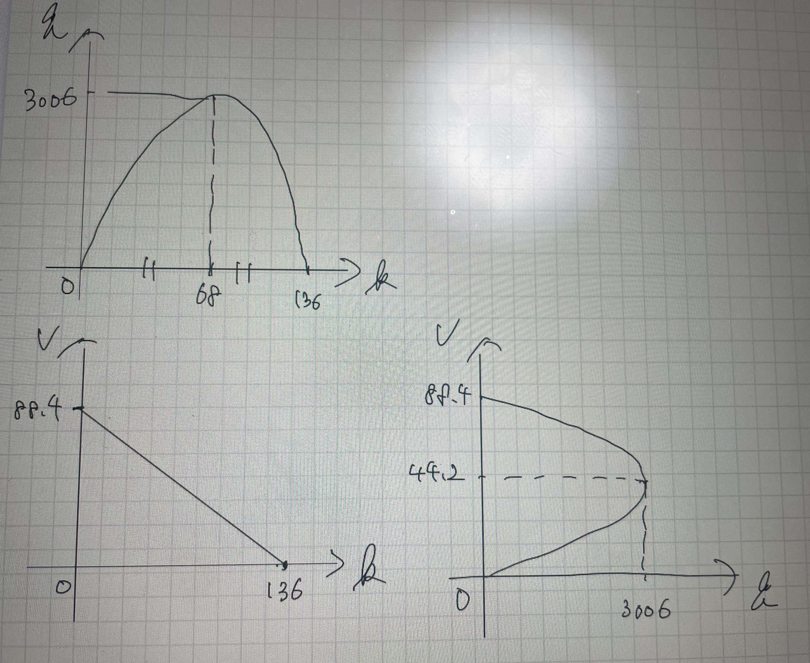
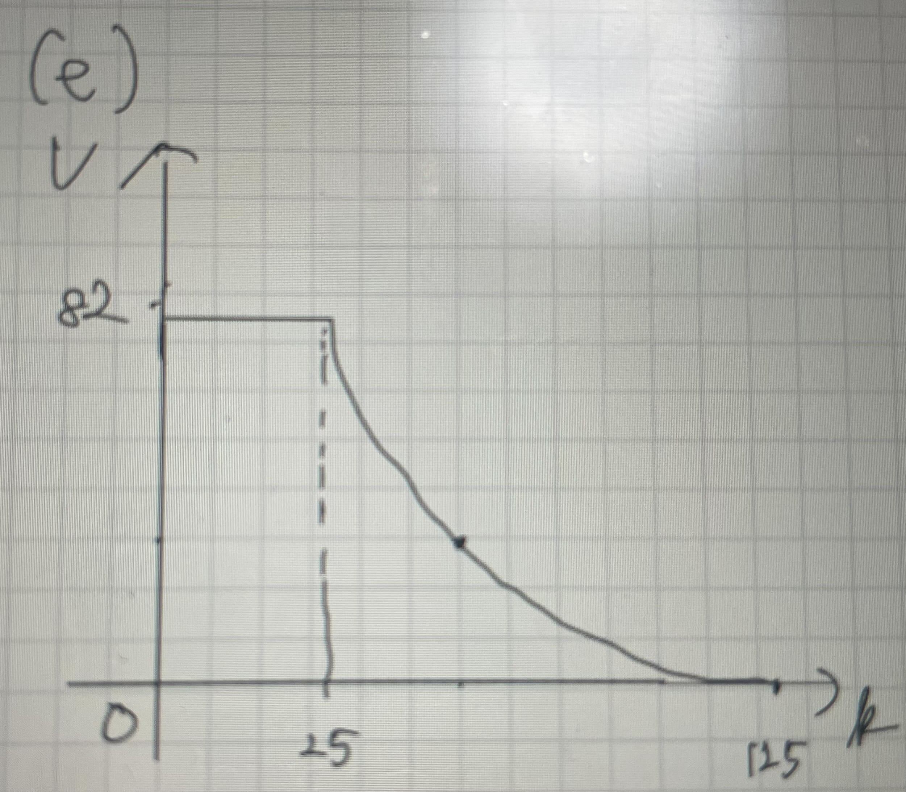
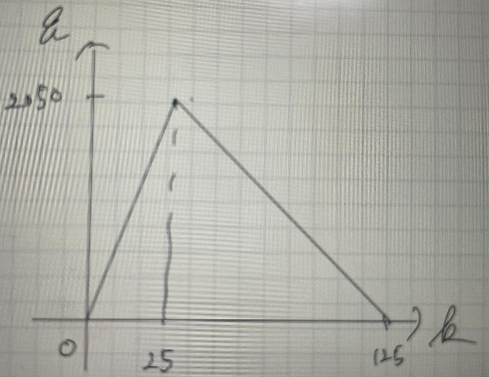
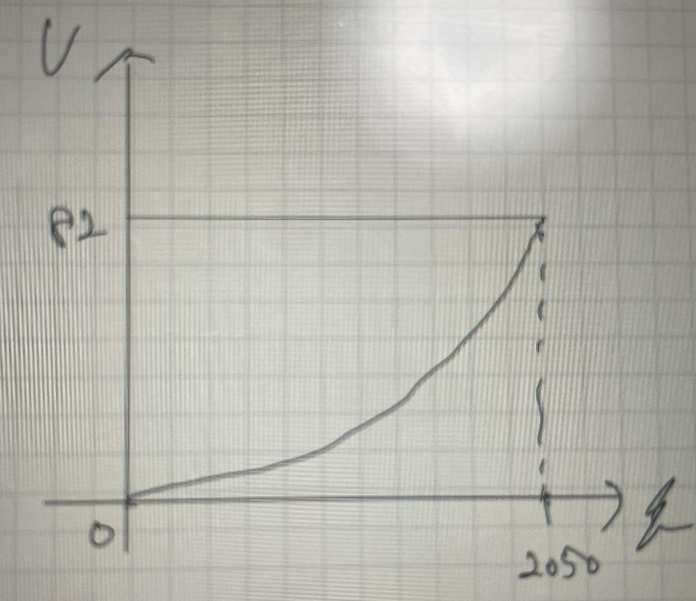
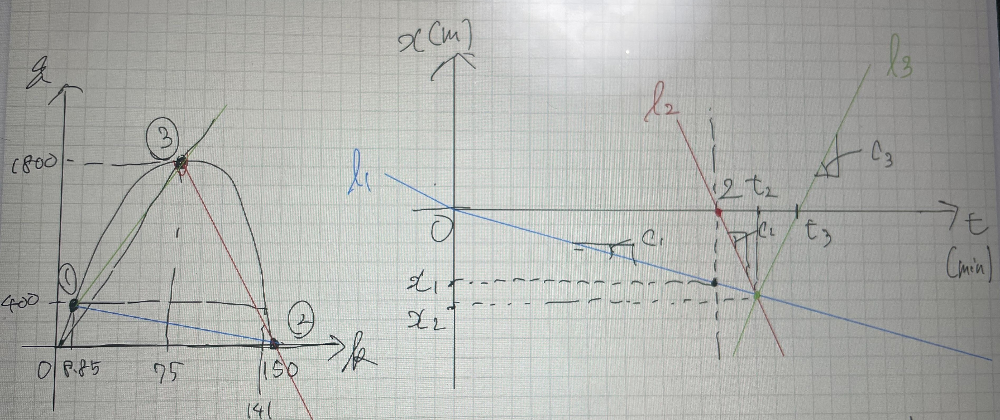
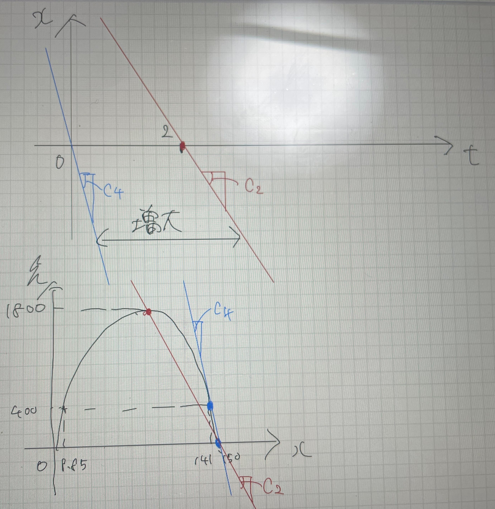

# Problem 1

- a)  
  Let the time-mean speed be $V_{\text{time}}$. Since $V_{\text{time}}$ is obtained as an arithmetic mean,
  $$
  V_{\text{time}}
  = \frac{76+80+77+80+75+84+90}{7}
  = 80.285\ldots \approx 80.23\ (\text{km/h})
  $$

- b)  
  Let the space-mean speed be $V_{\text{space}}$. Since $V_{\text{space}}$ is obtained as a harmonic mean,
  $$
  V_{\text{space}}
  = \frac{7L}{L/76 + L/80 + L/77 + L/80 + L/75 + L/84 + L/90}
  = 80.005\ldots \approx 80\ (\text{km/h})
  $$

- c)  
  Let the flow rate during 04:12:00--04:13:00 be $Q_{\text{all}}$, during 04:12:00--04:12:30 be $Q_a$, and during 04:12:30--04:13:00 be $Q_b$. Then,
  $$
  \begin{aligned}
  Q_{\text{all}} &= \frac{7}{1} = 7\ (\text{veh/min}) = 420\ (\text{veh/h}) \\
  Q_a &= \frac{5}{0.5} = 10\ (\text{veh/min}) = 600\ (\text{veh/h}) \\
  Q_b &= \frac{2}{0.5} = 4\ (\text{veh/min}) = 240\ (\text{veh/h})
  \end{aligned}
  $$

- d)  
  Let the traffic density be $k$. Assuming the relationship (flow rate)$=$(density)$\times$(space-mean speed), i.e., $q = kv$, holds,
  $$
  k = \frac{Q_{\text{all}}}{V_{\text{space}}}
    = \frac{420}{80}
    = 5.25\ (\text{veh/km})
  $$

- e)  
  An assumption is that all vehicles travel over a common road segment and each vehicle maintains a constant speed on that segment.

---

# Problem 2

- a)  
  The speed chosen by a driver under a given road condition when the driver can travel *freely* without being affected by other traffic.

- b)  
  From $v=0$,
  $$
  \begin{aligned}
  0 &= 88.4 - 0.65k \\
  k &= 136\ (\text{veh/km}) = 0.136\ (\text{veh/m}) \\
  \text{mean spacing } s &= \frac{1}{k} \approx 7.35\ [\text{m/veh}]
  \end{aligned}
  $$

- c)  
  From $q = kv$,
  $$
  \begin{aligned}
  q &= k\,v(k) = k(88.4 - 0.65k) \\
  \frac{dq}{dk} &= 88.4 - 0.65k + k(-0.65) = -1.3k + 88.4 = 0 \\
  k_c &= 68 \\
  \therefore\ q_{\max} &= 68(88.4 - 0.65\cdot 68) \approx 3006\ (\text{veh/h})
  \end{aligned}
  $$

- d)  
  The result is as shown in the figure below.

- e)  
- The result is as shown in the figure below.

# Problem 3

- d)  
  Assuming the initial state is in the free-flow regime, the FD and the time-space diagram are as follows:

  $$
  \begin{aligned}
  l_1 &: x = -47.1t \\
  l_2 &: x = -400t + 800 \\
  l_3 &: x = 352.6t - 901
  \end{aligned}
  $$

- a)  
  The queue becomes the longest at $t=2\ \text{min}$. The queue length at this time is obtained by substituting $t=2\ \text{min}$ into $l_1$, giving
  $$
  x = 94\ (\text{m})
  $$

- b)  
  The required time is the intersection time of the shock wave for queue formation (due to the stoppage) and the shock wave for queue dissipation (due to restarting). Therefore, we find the intersection of $l_1$ and $l_2$:
  $$
  \begin{aligned}
  -47.1t &= -400t + 800 \\
  t &= 2.26\ (\text{min})
  \end{aligned}
  $$

- c)  
  From the diagram, when the queue disappears, the incident cross-section is in state (3) on the FD, which differs from the original state. The traffic returns to the original state at the intersection of $l_3$ and $t=0$. Thus,
  $$
  \begin{aligned}
  -400t + 800 &= 352.6t - 901 \\
  t &= 2.56\ (\text{min})
  \end{aligned}
  $$

- e)  
  From the figure, since

  $$
  \text{(shock-wave speed for queue growth)} > \text{(shock-wave speed for restart)},
  $$
  the queue keeps growing.
