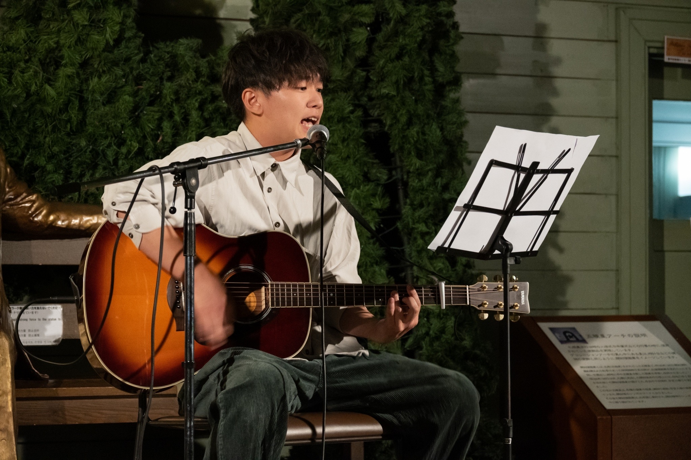
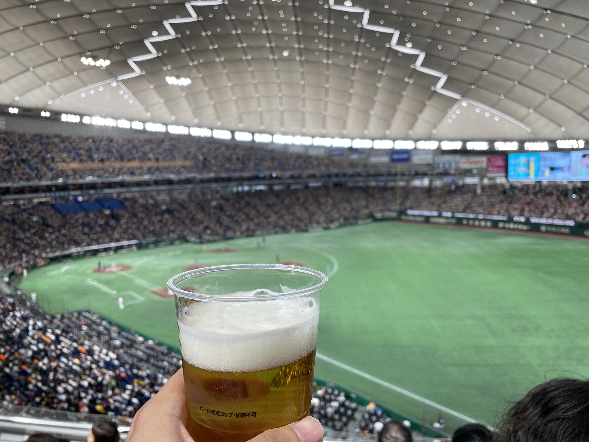
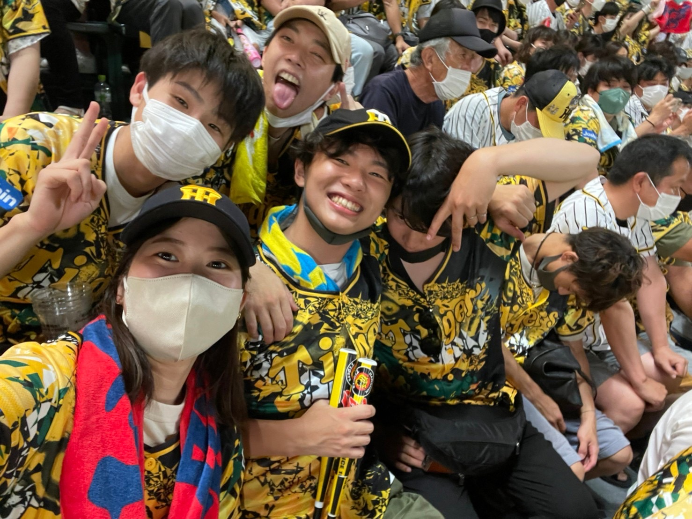
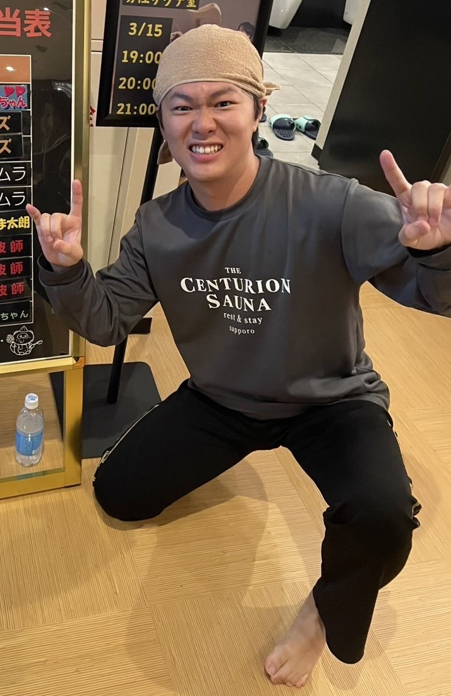
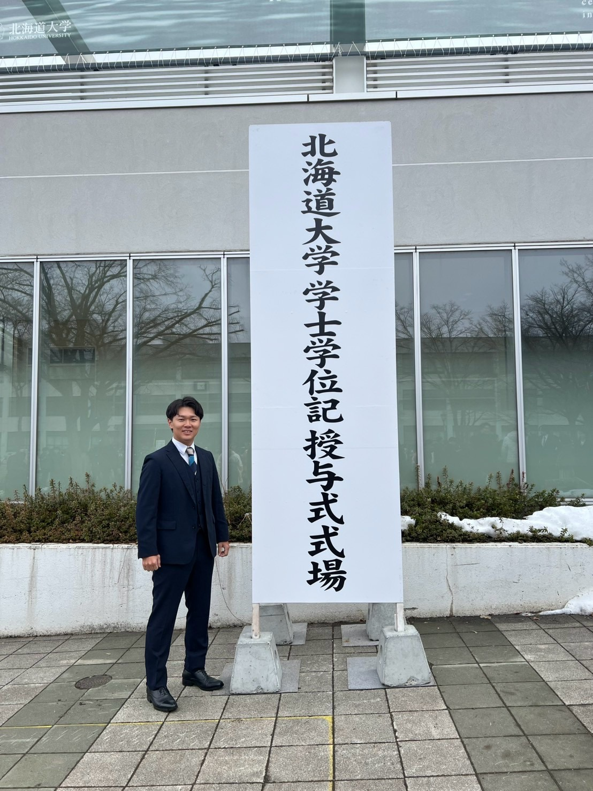
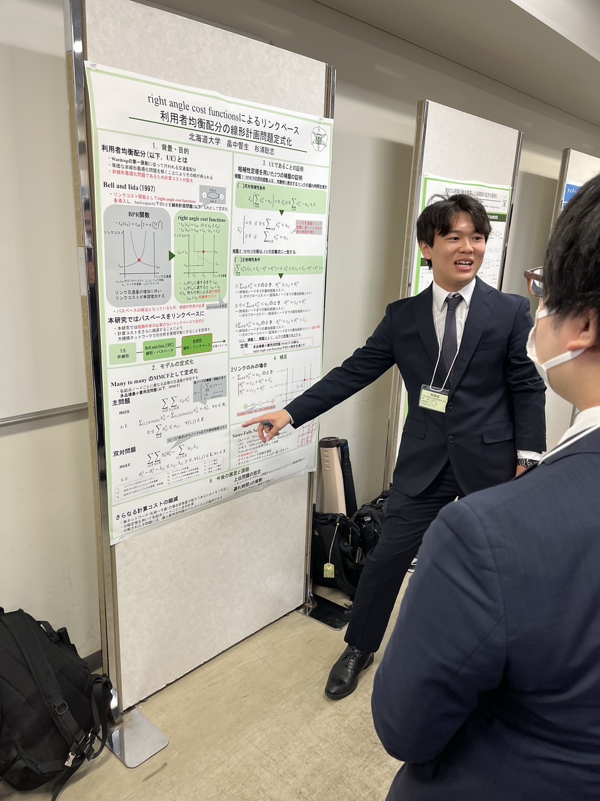

<!--
headingDivider: 2
-->

# Self Introduction

Hibiki HATAKENAKA/畠中響生
2025/04/09

<!-- class: slides -->

## Basic information
### Name
- Hibiki HATAKENAKA(畠中響生)
### Age
- 23 years old(born in June 14th, 2001)
### Place of birth
- Sakai City, Osaka Prefecture
- lived for 19 years!
.jpg)
## Hobbies
### Espesially
- Baseball
- Sauna
### Others
- Guitar
- Table tennis
- Travel
- Eating

## Baseball
### No Tigers, no life.
- I love Hanshin Tigers!!!!!!!!!!!!

## Sauna
- Relaxing time(ととのい) is so important!!!
- Worked part-time at a sauna (also plan to do this in Tokyo)

## Undergraduate years
### Hokkaido University
- I lived in Sapporo for 4 years.
- Traveled all over the place (let's go to Hokkaido together!)

## Graduation research
- Belonged to the Transportation Network Analysis Laboratory (Prof. Satoshi Sugiura)
- "Linear programming problem formulation for link-based user equilibrium assignment problem with right-angle cost functions assumption"
	- Efficiency of user equilibrium assignment
	- Presented at the The 70th Infrastructure Planning Conference

## Goals for this year
### Good research
- planning for pedestarian, walkable street, functionally Hierarchical Road Network, vitalization in City Center(中心市街地の活性化)
- I espesially want to contribute to rural area
### Others
- improve my English
	- especially listening...
- To make a lot of friends
- To finish the Hokkaido Marathon
  - to go on a diet...