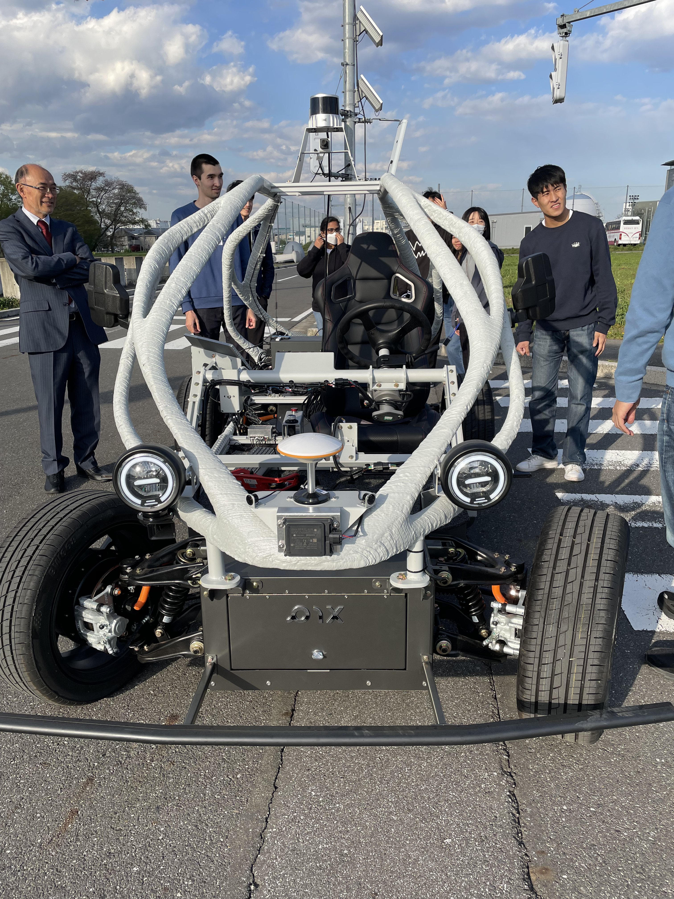
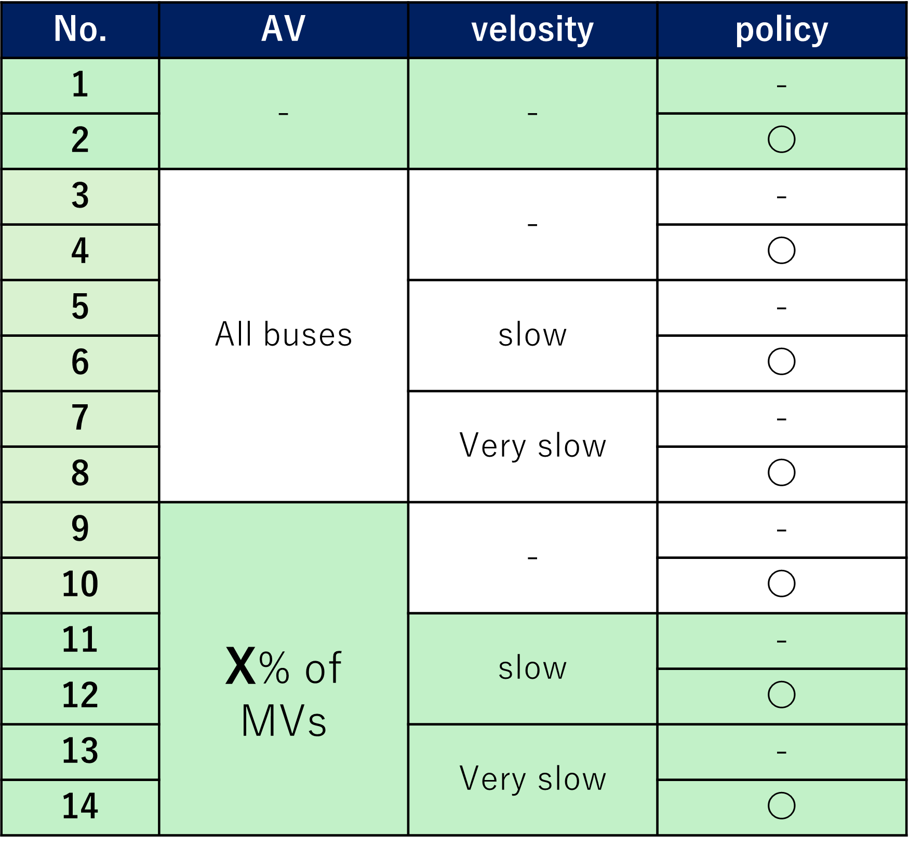
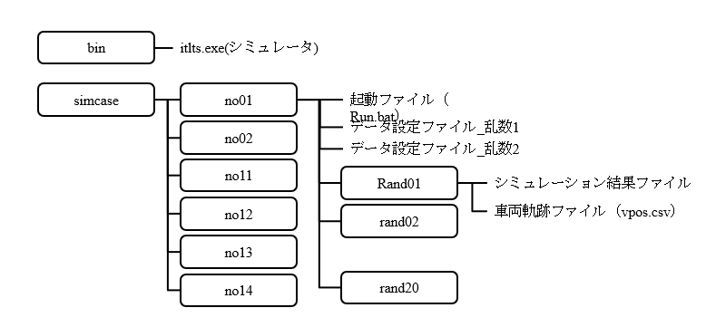

<!--
headingDivider: 2
-->

# lab-seminar

Hibiki HATAKENAKA  
2025/07/09

<!-- class: slides -->

## Structure
### 1. Background of the research
### 2. Previous Research
### 3. My Research
### 4. Future Work / Discussion

# 1. Background 
## Advancement of Autonomous Driving Technology
- The development of autonomous driving technology is progressing
	- Including concepts like vehicle-to-infrastructure (V2I) communication
	- Emergence of Tesla and Waymo

## Social Implementation Is a Major Challenge
- Demonstration experiments are being conducted nationwide
	- There is a need for research that clarifies the social impacts of autonomous vehicles and helps formulate necessary policies.

# Review of Previous Research
## Evaluation of Traffic Impact by Autonomous Shuttle Bus in Kashiwanoha
- Evaluation of the impact on traffic flow around Kashiwanoha Campus 
- level 4 autonomous shuttle bus between Kashiwanoha and Kashiwa Campus  

## Scenarios
- Simulation conducted for six scenarios:
	- No autonomous vehicle, no policy(Case1)
	- With autonomous vehicle, no policy(Case2)
	- With autonomous vehicle, with policy(Case3-6)  

## Results ＆ Consideration
- No significant impact was observed in any case
- Probably because it was only one vehicle
- Need to simulate with increased vehicle numbers

## Paper on ACC (Adaptive Cruise Control)
### two simulators: traffic flow＆energy consumption
- I. How do ACC penetration rate and following distance settings affect traffic flow?
- II. For gasoline vehicles, how do the above conditions affect fuel consumption?
- III. For EVs, how do the above conditions affect energy consumption?

## Results
- For each combination of following distance (traffic volume) and ACC penetration (autonomous ratio), congestion outcomes  

## Results
- Fuel consumption for gasoline vehicles  
 - Higher speeds result in better fuel efficiency  

## Results
- Impact for EVs  
	- Larger following distances lead to better energy efficiency  
	- Due to dependence on acceleration  

## Consideration
- For fuel consumption:
	- Gasoline vehicles are more affected by speed
	- EVs are more affected by acceleration
- For gasoline vehicles, sometimes lower ACC penetration is better depending on following distance, but for EVs, higher ACC penetration is always better
- Could be applicable to autonomous driving technology as well?

# 2. My Research
## Therefore, in this study:
### Overview and Scheme
- Using the same Kashiwanoha network as the one-vehicle case, simulate with increased number of autonomous vehicles
- Two simulation targets: traffic flow and fuel consumption (gasoline & EV)

## What Needs to Be Analyzed
- Traffic Flow:
	- How does autonomous vehicle affect traffic flow?
	- How does the speed of autonomous vehicles affect traffic flow?
		- Considering safe design
	- How effective are infrastructure measures?
- Fuel Consumption:
	- What is energy consumption when all vehicles are gasoline?
	- What is energy consumption when all vehicles are EVs?
	- How do infrastructure measures impact energy consumption?

## Hypotheses
- Traffic Flow:
	- Traffic flow may worsen with the introduction of autonomous vehicles
- Fuel Consumption:
	- In mixed traffic of human-driven and autonomous vehicles:
		- Lower speeds increase gasoline consumption
		- For EVs, fuel efficiency may improve with higher autonomous vehicle penetration

## Scenario
- The scenarios are as follows  
Infrastructure policy:
Add dedicated parking/stopping spaces to reduce parking impact.

- No.1 & No.2:
Scenarios without AVs, with or without infrastructure policy.
- No.4 to No.8:
All buses are replaced by AVs.
Different scenarios tested with low or very low speeds for safety.
- No.9 to No.14:
Simulations with X% of private cars replaced by AVs.

## Calculation Method
- File structure

## Efficiency improvement 
- Want to run 20 random files in parallel for one scenario
	- The tasks to be parallelized:
		- Simulation execution
		- Data conversion (for Pioneer submission)
		- Data compression (due to large size)
		- Deletion of raw data
		- Using either batch files or Python
 - Currently using batch files, but each simulation is heavy, so parallelization doesn't speed it up much

# 4. Future Work / Discussion
## Upcoming Schedule
- This study is planned to be submitted to the autumn conference or ITS symposium
- (July) Review of previous studies
- (July–August) Simulation runs
- (August–October) Analysis
- (November or December) Presentation

## Future Challenges
- There is much room for further development and discussion
	- Expand evaluation indicators, scenarios, and policies
	- Cross-city comparisons
	- Signal control
	- Pedestrian modeling
	- Network design

# Appendix
## シミュレーターについて
- MicroAvenueについて
- 　本研究に用いた交通流シミュレータは，株式会社アイ・トランスポート・ラボ製のMicroAVENUEである(Horiguchi, 1994)．ACCの車両追従挙動を表現するために，非線形追従モデルの一種であるIntelligent Driver Model (IDM)(Treiber et al., 2000) が広く用いられている． Schakel, et al（2010）は、交通流の安定性を表現するために、IDMコントローラの改良版（IDM+）を導入した。MicroAVENUEは，追従挙動の表現にこのIDM+を用いており，縦断勾配による速度低下や渋滞のショックウェーブの状況などを表現することが可能である．シミュレーションにおけるACCが稼働している車両は，稼働していない車両と比較して，勾配による重力加速度の影響を受けない設定とした． 

## 燃料消費量シミュレーターについて
Pt=k1+k2⋅| α+g⋅sin⁡(θ)|×V
+k3⋅(V^3+a1⋅V^2+a2⋅V)  　　(1)

Pt=k1-k2⋅β⋅ | α+g⋅sin⁡(θ)|×V
+k3⋅(V^3+a1⋅V^2+a2⋅V)　　(2)

ここで，式(1)はα+g⋅sin⁡(θ)≧0の場合，式(2)はα+g⋅sin⁡(θ)<0の場合を表す．ここで，Ptは単位時間当たりのエネルギー消費量, k1は基本消費量，k2は加減速及び傾斜による消費係数，k3は空気抵抗，転がり抵抗による消費係数，a1,a2は定数, Vは車速，αは加速度, βは回生率，θは傾斜角，gは重力加速度を示す．右辺第1項はアイドリング時のエネルギー消費量であり，速度に依存しない成分となる．右辺第2項は勾配抵抗と加速抵抗分のエネルギー消費量であり，速度変化による運動エネルギーの変化分と，高度変化による位置エネルギーの増減分である．右辺第3項は転がり抵抗成分及び空気抵抗成分によるエネルギー消費量である． 