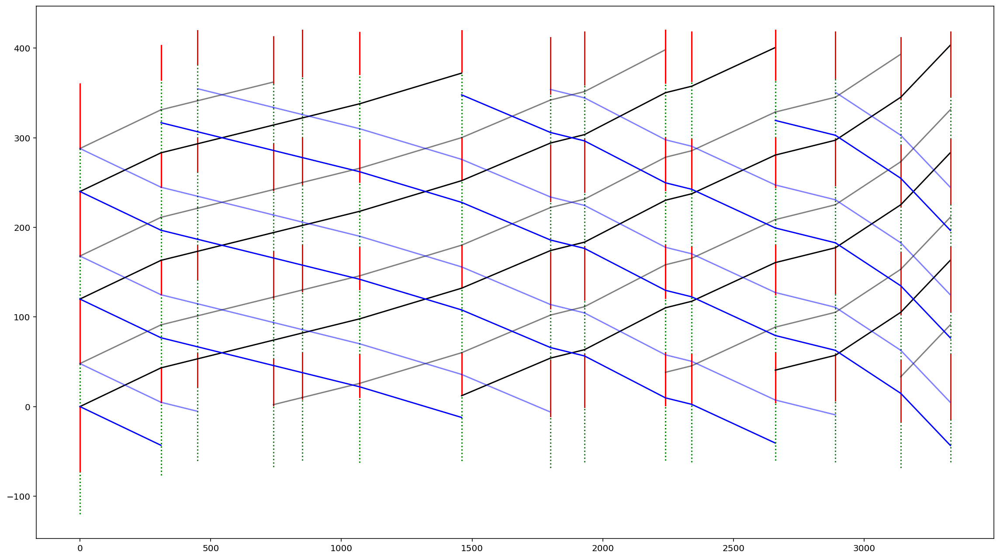
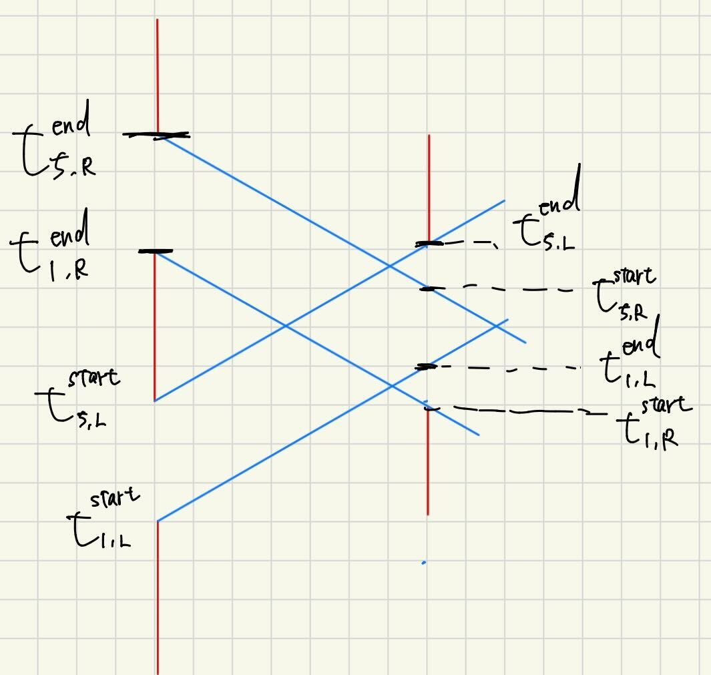
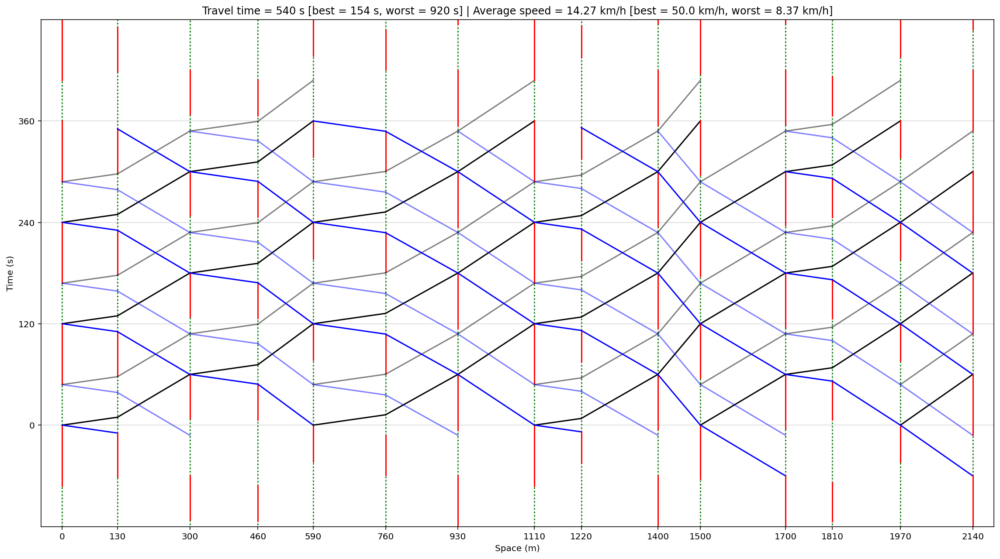
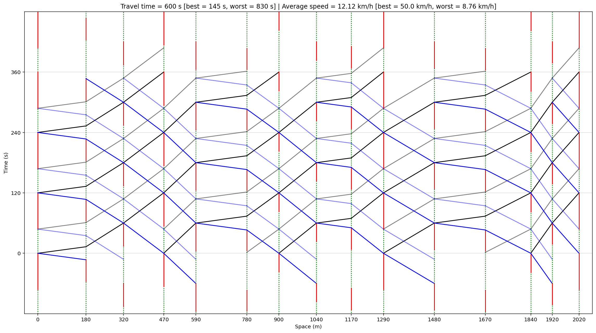
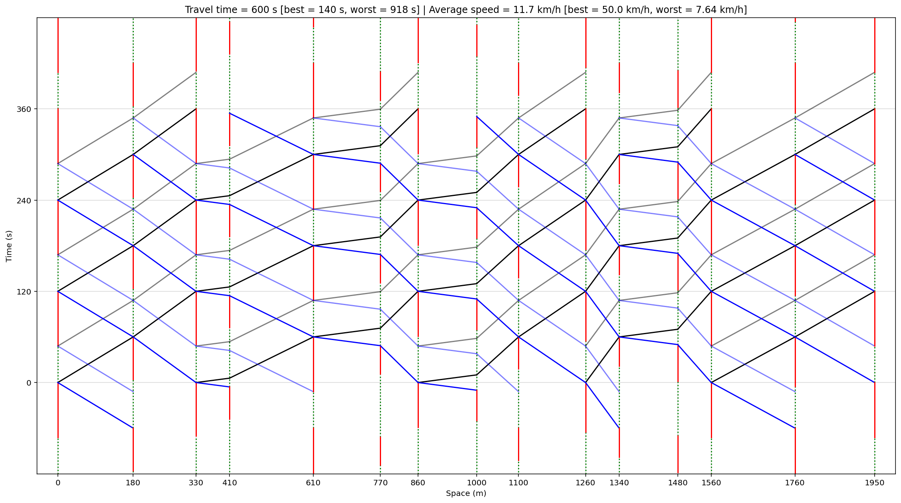
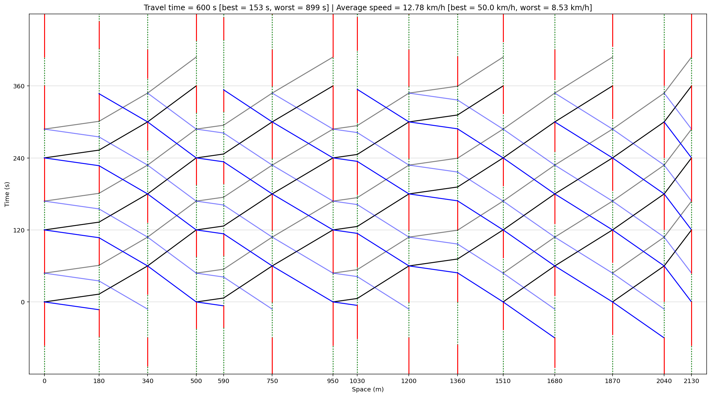
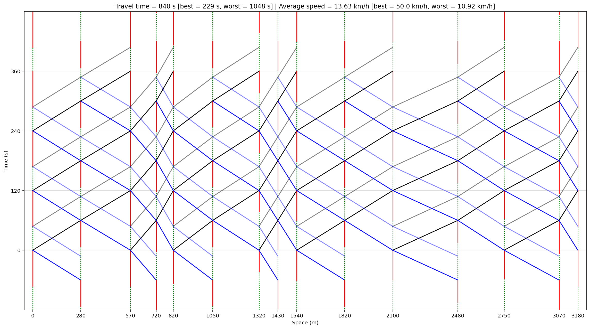
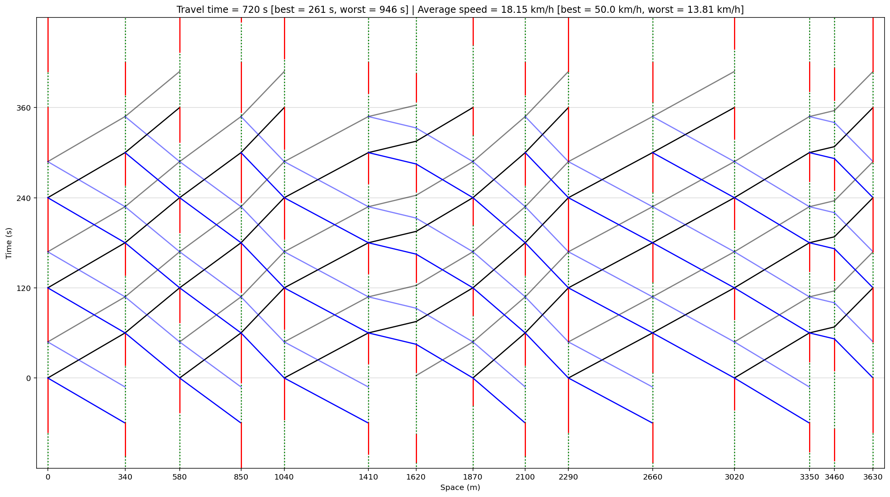
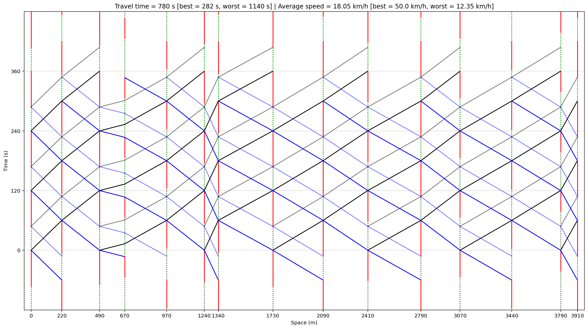

<!--
headingDivider: 2
-->

# 20260203

Hibiki HATAKENAKA/畠中響生
2026/02/03

<!-- class: slides -->
## 既往研究の整理
遅れの一般式から，遅れをゼロにするようなオフセット集合が求められ，そこから系統効果の高い基準化リンク長$Λ$が導かれる．
$$
\Lambda_{hce}\in[0,\delta\Gamma]\quad (k=0),\qquad
\Lambda_{hce}\in\left[\frac{k}{2}-\delta\Gamma,\ \frac{k}{2}+\delta\Gamma\right]\quad (k\ge 1)
$$
## 既往研究の整理
$x_{hce}$も$Λ$であらわされるため，以下のように導ける．

$$
\Delta\Lambda^+ \equiv \left(N+\frac12+\delta\Gamma\right)-\Lambda,\qquad
\Delta\Lambda^- \equiv \Lambda-\left(N+\frac12-\delta\Gamma\right) 
$$
$$
\delta\Lambda \equiv \min\{\Delta\Lambda^+,\Delta\Lambda^-\}
$$
$$
\boxed{
x_{hce}\in \left\{\rho(\delta\Delta g+u)\ \big|\ u\in[-\delta\Lambda,\delta\Lambda]\right\}
}
$$
## 系統効果の高い速度の導出
(1)$k=0$
$\Lambda=L/(CV)$ より
$$
V=\frac{L}{C\Lambda}
$$
より，$\Lambda\le\delta\Gamma$ を満たす速度は

$$
\boxed{
V_{hce}\ge \frac{L}{C\delta\Gamma}
}
$$

## 系統効果の高い速度の導出
(2)$k\ge 1$
$$
\Lambda_{hce}\in\left[\frac{k}{2}-\delta\Gamma,\ \frac{k}{2}+\delta\Gamma\right]\quad(k\ge 1)
$$

を $V=L/(C\Lambda)$ で反転すると

$$
\boxed{
V_{hce}\in
\left[
\frac{L}{C\left(\frac{k}{2}+\delta\Gamma\right)},\ 
\frac{L}{C\left(\frac{k}{2}-\delta\Gamma\right)}
\right]
\qquad
\left(k\ge 1\right)
}
$$
を得る．

## 多交差点への実装
### 設計思想
- 2交差点の理論を適用するには，platoon(車群)が途切れないことが重要
### 諸条件
- 交差点 $1,\dots,n$（例 $n=15$）
- 共通サイクル長 $C$
- リンク長 $L_i$（リンク $i\leftrightarrow i+1$，$i=1,\dots,n-1$）
- 有効青割合 $g(i)\in[0.4,0.7]$
- 車群占有割合 $P=0.4$
- 速度上限 $V_{\max}=50\ \mathrm{km/h}$
- 最大加速度 $a$，最大減速度 $b$（単位整合に注意：基本は $\mathrm{m/s}$ 系で）

## 多交差点への実装
各リンク $i$ について
- $\delta\Gamma_i \equiv \dfrac{g(i)+g(i+1)}{2}-P$
- $V_{hce,i}$：を算出
  $$
  \mathcal V_i \equiv V_{hce,i}\cap (0,V_{\max}]
  $$
- 初期案：
  $$
  V_i^{\mathrm{ideal}} \leftarrow \max \mathcal V_i
  $$

## 多交差点への実装
- 目標旅行時間
  $$
  \tau_i^\star \equiv \frac{L_i}{V_i^{\mathrm{ideal}}}
  $$
- 規準化リンク長：
  $$
  \Lambda_i \equiv \frac{L_i}{C V_i^{\mathrm{ideal}}}
  $$
- $Λ$が決まれば最適オフセット集合も導出できる
- 本解法により，すべての2交差点間の系統効果を，各リンクの系統速度(各リンクの旅行時間)を調整したことによって高くすることができた．これにより，グリーンウェーブが実現できる(?)

## 結果

##　失敗した原因
- 遅れの一般式が，「理想的な到着パターンを想定しているから」
- プラトゥーンが途切れなかったとしても．

## プラン2
- 双方向のスルーバンドがプラトゥーンを崩さないように，交差点$i$を通過する条件
$$
P≦ρ(t^{end}_{f,L} - t^{start}_{1, R})≦g_{i}
$$

## プラン2
これを変形すると
$$
\frac{N-\delta{t}}{2}≦Λ≦\frac{g_i+N-\delta{t}-P}{2}
$$
ただし$\delta{t}=t^{start}_{1,L}-t^{end}_{1,R}$
よって，以下が導かれる．
$$
\frac{2L}{C(g_i+N-\delta{t}-P)}≦V_{hce+}≦\frac{2L}{C(N-\delta{t})}
$$

- $g_i$の開始時間が$t^{end}_{1, L}$に一致するようにオフセットを調整
- リンク$(i-1, i)$の平均速度$V_{i-1, i}=max(V_{hce}, 50km/h)$とする

## 結果

## 結果

## 結果

## 結果

## 結果

## 結果

## 結果

## 結果
| 路線番号 | $T_{Popt}$ | $T$ | $T_{Lpri}$ |
| ---- | ---- | ---- | ---- |
| 1-020 | 253.02 | 540 | 288.5 |
| 1-034 | 202.82 | 600 | 254.25 |
| 1-041 | 292.07 | 600 | 311.5 |
| 1-097 | 222.32 | 600 | 275.25 |
| 2-018 | 326.49 | 840 | 401.00 |
| 2-034 | 322.96 | 720 | 415.25 |
| 2-043 | 496.03 | 780 | 546.00 |

## まとめ
### 改善方法
- できるだけ青時間をめいいっぱい使いたい
- オフセットを決め打ちしているがそれが本当に最適かはわからない
- infeasibleになる場合，基軸交差点を入れる(あえてプラトゥーンを丸ごと停止させる)

### 現行の方法のメリット
- 停止回数が少ないので走行の仕方によっては燃料消費量が少ない
- すべての車(双方向，プラトゥーン内)の平等性が保たれている

